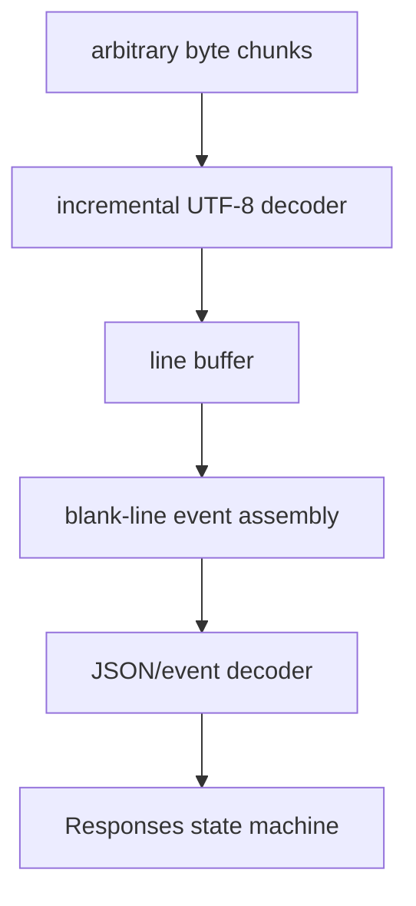

# Server-Sent Events Deep Dive

업데이트: 2026-09-02

## 1. SSE의 정확한 위치

SSE는 `text/event-stream` media type의 UTF-8 text를 HTTP response content로 전달하는 형식이다. browser `EventSource` API는 통상 GET으로 연결하지만, LLM API/SDK는 POST request의 response body를 같은 event-stream 형식으로 직접 parse하기도 한다.

따라서 두 가지를 구분한다.

| 항목 | Browser EventSource | LLM SDK의 POST SSE |
|---|---|---|
| request method | 일반적으로 GET | 보통 POST |
| browser 자동 reconnect | 표준 동작 | SDK/API 구현에 따라 다름 |
| `Last-Event-ID` 활용 | 표준 mechanism 존재 | API가 resume을 구현해야 의미 있음 |
| request body | 없음 | prompt/input/tools 포함 |
| replay 안전성 | resource semantics에 의존 | generation/tool POST replay는 위험 가능 |

“SSE는 자동 reconnect된다”는 문장은 browser EventSource 동작에는 맞을 수 있지만, **LLM POST stream이 안전하게 이어진다는 뜻은 아니다.**

## 2. Event grammar

대표 event는 다음과 같다.

```text
event: response.output_text.delta
id: evt_42
data: {"delta":"hel"}
data: {"sequence_number":7}

```

- 빈 줄이 event를 dispatch하는 delimiter다.
- `data:` line이 여러 개면 parser가 newline으로 결합한다.
- `event:`는 event type을 지정한다.
- `id:`는 last event ID를 갱신할 수 있다.
- `retry:`는 EventSource reconnect delay hint다.
- `:`로 시작하는 line은 comment이며 heartbeat에 쓰일 수 있다.

LLM vendor가 JSON payload 안의 `type`만 사용하고 SSE `event:` field를 생략할 수도 있다. client는 해당 API contract를 기준으로 parse한다.

## 3. 올바른 incremental parser

다음 parser는 잘못됐다.

```text
socket read 1회 == JSON event 1개
```

올바른 parser는 개념적으로 다음 상태를 가진다.

1. arbitrary bytes를 수신한다.
2. UTF-8 decoder가 split code point를 복원한다.
3. line ending을 인식한다.
4. 빈 줄까지 field line을 누적한다.
5. event field/data line을 조립한다.
6. application JSON을 decode한다.
7. event sequence와 terminal state를 검증한다.



## 4. Responses streaming은 token stream 이상이다

Responses 계열 SSE에는 text 외에도 item lifecycle이 있다.

```text
response.created
response.in_progress
response.output_item.added
response.content_part.added
response.output_text.delta × N
response.output_text.done
response.output_item.done
response.completed
```

reasoning, function/custom tool call, tool argument delta, usage, error도 별도 event가 될 수 있다. 따라서 client가 text delta만 이어 붙이면 다음 정보를 잃는다.

- output item ID와 ordering
- tool call ID/name/arguments
- reasoning item과 summary
- terminal status와 incomplete reason
- usage accounting

proxy/router가 byte stream을 재해석하지 않더라도 **event order, status, content type, final delimiter, disconnect**를 그대로 보존하는지 검증해야 한다.

## 5. Flush와 buffering

server가 event를 생성한 시각과 client가 event를 보는 시각 사이에는 여러 buffer가 있다.

| buffer | 문제 | 검증 방법 |
|---|---|---|
| application/runtime | event가 일정 크기까지 flush되지 않음 | server event timestamp와 socket write 비교 |
| reverse proxy | proxy buffering으로 TTFT/ITL 악화 | buffering off 전후 curl trace 비교 |
| compression | 작은 delta가 compressor에 모임 | SSE compression on/off 비교 |
| HTTP/2/TCP | flow control·Nagle-like coalescing 효과 | packet capture와 application trace 연계 |
| client SDK | parser/read buffer가 event dispatch 지연 | raw client와 SDK 비교 |

첫 byte가 빠르더라도 첫 semantic event가 늦을 수 있다. 다음 timestamp를 분리한다.

- request accepted
- backend selected
- upstream response header
- first upstream byte
- first complete SSE event
- first text/reasoning/tool delta
- terminal event
- connection close

## 6. Disconnect, cancel, resume

SSE는 server → client channel이다. client가 추가 input/tool result/cancel을 보내려면 보통 별도 HTTP request를 사용한다.

client disconnect 뒤 가능한 server 동작은 구현마다 다르다.

- generation 즉시 cancel
- downstream은 끊겼지만 upstream generation 계속
- background response로 계속 실행·persist
- cancel propagation 지연

resume도 자동 보장이 아니다. 안전한 resume에는 최소한 다음이 필요하다.

- stable operation/response ID
- ordered event sequence 또는 cursor
- persisted event/item state
- client가 이미 적용한 마지막 event 식별
- duplicate event 적용을 막는 idempotent reducer
- tool side effect와 generation replay 정책

## 7. Heartbeat

긴 prefill/reasoning 동안 application delta가 없으면 proxy idle timeout이 connection을 끊을 수 있다. SSE comment heartbeat는 connection activity를 만들 수 있다.

```text
: keep-alive

```

하지만 heartbeat는 다음을 증명하지 않는다.

- model이 진전 중임
- state commit이 성공함
- tool이 살아 있음
- operation이 terminal event까지 완료될 것임

heartbeat metric과 operation progress metric을 분리한다.

## 8. LLM SSE conformance test

### fragmentation

- 한 event를 모든 byte offset에서 강제로 split한다.
- UTF-8 multi-byte character 중간을 split한다.
- 여러 event를 한 read chunk로 합친다.
- `\r\n`, `\n`, multi-line `data:`를 시험한다.

### semantic ordering

- created → item/content delta → done → completed 순서를 확인한다.
- terminal event가 정확히 한 번인지 확인한다.
- error status와 error event가 정상 전달되는지 확인한다.
- reasoning/tool/text item을 모두 포함한다.

### failure

- response header 전 upstream failure
- 첫 event 뒤 proxy restart
- tool call arguments 중간 disconnect
- client cancel/connection close
- slow consumer/backpressure
- rolling drain 중 existing stream과 new stream

공식 format은 [WHATWG Server-sent events](https://html.spec.whatwg.org/multipage/server-sent-events.html)를 참고한다.
