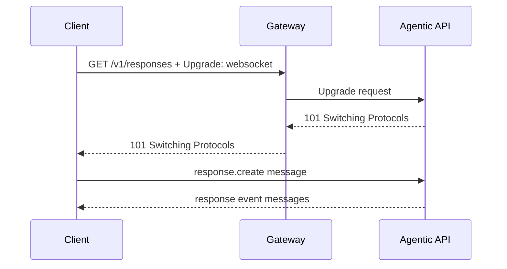

# WebSocket Deep Dive

업데이트: 2026-09-02

## 1. WebSocket이 필요한 경우

SSE가 하나의 HTTP response에서 server → client event를 흘리는 방식이라면 WebSocket은 connection을 유지하며 양쪽이 독립적으로 message를 보낼 수 있는 full-duplex channel이다.

LLM/agent workload에서 가능한 이점은 다음과 같다.

- connection/transport handshake amortization
- 여러 turn을 한 channel에서 전송
- client → server의 cancel, tool result, incremental input
- server → client의 output/reasoning/tool event
- prewarm과 `previous_response_id` 기반 delta continuation

하지만 “WebSocket이라서 더 stateful하다”가 아니라, **application protocol이 connection 위에 stateful operation contract를 구현할 수 있다**가 정확하다.

## 2. Handshake

HTTP/1.1 WebSocket은 client가 Upgrade request를 보내고 server가 `101 Switching Protocols`로 수락한 뒤 WebSocket framing을 사용한다.



HTTP/2에서는 classic `Connection: Upgrade`가 아니라 [RFC 8441 extended CONNECT](https://www.rfc-editor.org/rfc/rfc8441.html) 지원이 필요하다. 모든 client/proxy/backend 조합이 이를 지원한다고 가정하지 않는다. 실제 배포에서는 edge 구간을 H1 WebSocket으로 유지하거나 제품의 H2 WebSocket 지원을 명시적으로 검증한다.

## 3. Frame과 message

WebSocket은 text/binary data frame, continuation frame, ping, pong, close control frame을 정의한다.

- application message 하나가 여러 frame으로 fragmented될 수 있다.
- TCP read 한 번이 WebSocket frame/message 하나와 일치하지 않는다.
- client → server frame은 masking된다.
- ping/pong은 connection liveness에 도움을 주지만 operation progress를 증명하지 않는다.
- close handshake와 비정상 TCP close를 구분한다.

SDK/runtime의 WebSocket library가 frame 재조립을 맡더라도 application은 JSON message type, operation ID, sequence를 검증해야 한다.

## 4. Multiplexing은 application 책임일 수 있다

WebSocket connection 하나에 여러 logical operation을 동시에 허용하려면 message에 correlation identity가 필요하다.

```json
{
  "type": "response.create",
  "request_id": "req_42",
  "input": []
}
```

server event도 같은 operation/response identity로 연결해야 한다. 그렇지 않으면 interleaved delta와 cancel 대상이 모호해진다.

검토 항목:

- connection당 active operation 수
- event ordering이 connection-global인지 operation-local인지
- parallel request 허용 여부
- cancel scope
- backpressure가 한 operation만 막는지 connection 전체를 막는지

## 5. WebSocket이 보장하지 않는 것

| 오해 | 실제 |
|---|---|
| message를 보내면 exactly-once 실행된다 | network loss 시 server 수신/실행 여부가 불명확할 수 있다 |
| reconnect하면 이전 connection state가 자동 복구된다 | application-level response ID, persisted state, resume contract가 필요하다 |
| ping 성공이면 model generation이 정상이다 | transport peer가 응답한다는 뜻일 뿐이다 |
| full-duplex라서 무조건 SSE보다 빠르다 | handshake amortization과 payload/implementation에 따라 다르다 |
| WebSocket connection이 유지되면 backend Pod도 바꿀 수 있다 | 일반 proxy/L4 path에서는 connection이 선택한 backend에 고정된다 |

## 6. Gateway와 Kubernetes 영향

WebSocket은 long-lived connection이므로 다음 영향을 크게 받는다.

- L4 Service는 handshake 때 만들어진 TCP flow를 한 backend Pod에 고정한다.
- Gateway/Ingress의 idle timeout과 maximum connection age가 적용된다.
- rolling update에서 readiness를 내리는 것만으로 이미 열린 connection이 종료되지는 않는다.
- Pod termination 전에 connection drain/close notification 시간을 확보해야 한다.
- connection 수 기반 load와 active generation 수 기반 load가 다르다.

WebSocket을 terminating하는 Agentic API가 내부 추론을 HTTP/SSE로 호출하는 구조는 정상이다.

```text
Client -- WebSocket --> Agentic API -- HTTP/SSE --> model router --> vLLM
```

따라서 downstream lmstack/router/vLLM이 client-facing WebSocket을 직접 구현할 필요는 없다. 다만 Agentic API가 disconnect, cancel, response state를 두 transport 사이에서 정확히 중계해야 한다.

## 7. Reconnect와 state machine

production reconnect에는 다음 상태가 필요하다.

1. connection ID와 authentication principal
2. response/operation ID
3. last accepted client command sequence
4. last delivered server event sequence
5. operation terminal/non-terminal state
6. tool side effect와 state commit status
7. replay 가능한 event retention 범위

재연결 client는 “마지막으로 받은 event”와 “마지막으로 server가 commit한 command”의 차이를 해소해야 한다. 단순히 마지막 JSON을 재전송하면 중복 operation이 될 수 있다.

## 8. 운영 체크리스트

- Gateway가 동일 path의 HTTP POST, SSE response, WebSocket Upgrade를 모두 올바른 backend로 보내는가?
- `Upgrade`/`Connection` 처리와 HTTP version negotiation을 확인했는가?
- auth token의 connection lifetime과 갱신/만료 정책은?
- ping/pong interval이 proxy idle timeout보다 짧은가?
- maximum connection age에 jitter가 있는가?
- Pod drain 시 new connection 차단 → existing operation 종료 → close frame → termination 순서인가?
- abnormal close 뒤 HTTP fallback 또는 WS reconnect가 application state와 일치하는가?
- 한 connection의 slow consumer가 memory를 무제한 점유하지 않는가?
- connection count, active operations, messages/bytes, close code를 별도 metric으로 수집하는가?

normative protocol은 [WebSocket RFC 6455](https://www.rfc-editor.org/rfc/rfc6455.html)를 따른다.
