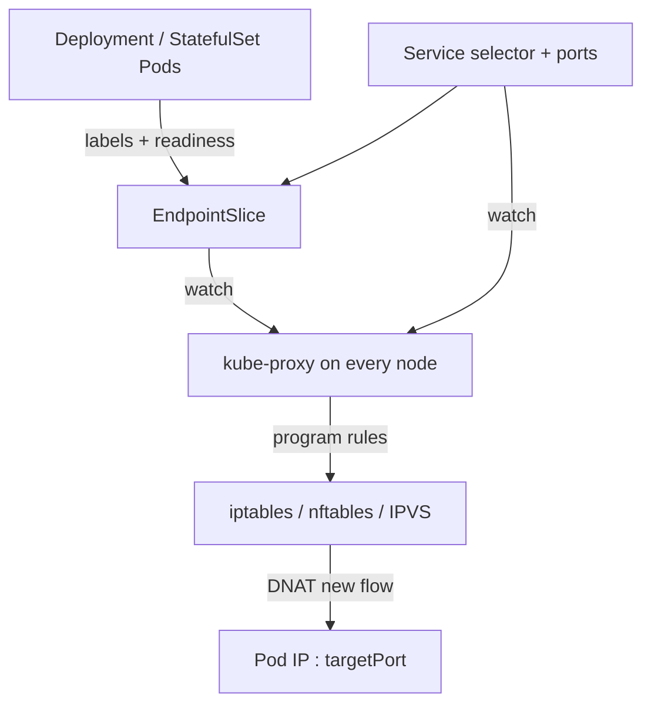
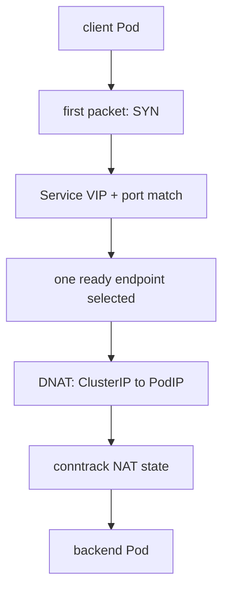

# Kubernetes Service와 EndpointSlice Routing

업데이트: 2026-09-02
기준: Kubernetes kube-proxy iptables mode를 중심으로 설명

## 1. Service는 무엇인가

Kubernetes Service는 변하는 Pod 집합 앞에 stable virtual address와 port를 제공하는 API object다. 일반적인 selector 기반 ClusterIP Service에는 application proxy process가 별도로 뜨지 않는다. control plane과 node dataplane이 다음 상태를 연결한다.



Kubernetes 문서상 EndpointSlice는 Service의 network endpoint를 표현하는 source of truth다. selector가 있는 Service는 controller가 matching Pod를 바탕으로 EndpointSlice를 관리한다.

## 2. Object contract

### 2.1 Service

```yaml
apiVersion: v1
kind: Service
metadata:
  name: model-a
spec:
  type: ClusterIP
  selector:
    app: model-a
    vllm-route: enabled
  sessionAffinity: None
  internalTrafficPolicy: Cluster
  ports:
    - port: 80
      targetPort: 8000
      protocol: TCP
```

- `clusterIP:80`은 client가 접속하는 virtual service address다.
- selector는 backend membership을 정의한다.
- `targetPort:8000`은 endpoint Pod의 실제 port다.
- `sessionAffinity: None`은 ClientIP affinity를 추가하지 않는다.
- `internalTrafficPolicy: Cluster`는 cluster 전체의 ready endpoint를 사용할 수 있게 한다.

### 2.2 EndpointSlice

개념적으로 다음 정보를 가진다.

```yaml
addressType: IPv4
ports:
  - port: 8000
endpoints:
  - addresses: [10.42.1.17]
    conditions:
      ready: true
      serving: true
      terminating: false
    nodeName: worker-a
```

Service selector가 실제 packet forwarding을 직접 수행하는 것이 아니다. selector 변화가 EndpointSlice membership으로 반영되고, kube-proxy가 그 변화를 watch하여 dataplane rule을 갱신한다.

## 3. kube-proxy iptables path

Pod가 ClusterIP에 새 TCP connection을 열 때 개념적 packet path는 다음과 같다.



iptables mode에서는 kube-proxy가 Service와 endpoint용 NAT chain을 만들고, 새 connection을 endpoint 중 하나로 확률적으로 보낸다. `KUBE-SERVICES`, `KUBE-SVC-*`, `KUBE-SEP-*` 같은 이름은 널리 관측되는 구현 형태지만 API contract는 아니므로 자동화에서 무조건 고정하지 않는다.

### 핵심: 선택 단위는 HTTP request가 아니라 connection/flow다

TCP conntrack entry는 보통 protocol, source/destination address와 port로 식별되는 flow에 NAT mapping을 유지한다. 같은 TCP connection의 후속 packet은 같은 backend로 간다.

```text
HTTP request #1 ┐
HTTP request #2 ├─ same keep-alive TCP connection
HTTP request #3 ┘
                  -> one conntrack/NAT backend
                  -> same Pod
```

HTTP/2에서는 한 TCP connection에 많은 concurrent HTTP stream을 multiplex할 수 있어 이 현상이 더 강해진다. SSE와 WebSocket은 request/connection 자체가 오래 살아 있으므로 backend 고정 시간이 길다.

## 4. `sessionAffinity: None`의 정확한 의미

`None`은 Kubernetes가 source ClientIP를 기준으로 별도의 sticky mapping을 만들지 않는다는 뜻이다. 다음을 뜻하지 않는다.

- 매 HTTP request마다 새 Pod를 고른다.
- 기존 TCP connection의 backend가 중간에 바뀐다.
- workload가 균등하게 분산된다.

새 connection이 충분히 많고 비슷한 비용을 가질 때만 connection-count 분산이 request/load 분산과 가까워진다. LLM request는 prompt 길이와 output 길이 차이가 크므로 round-robin connection 수와 GPU load는 쉽게 어긋난다.

## 5. Endpoint lifecycle

EndpointSlice condition은 rollout/drain 분석에서 중요하다.

| condition | 의미 | 일반적인 proxy 판단 |
|---|---|---|
| `ready` | 새 traffic을 받을 준비가 됐는가 | false endpoint는 정상 traffic에서 제외 |
| `serving` | 실제로 traffic을 처리할 수 있는가 | terminating endpoint의 drain 상태 표현에 유용 |
| `terminating` | endpoint의 Pod가 종료 중인가 | 새 flow를 피하고 기존 flow drain에 활용 가능 |

정확한 사용은 proxy implementation과 Kubernetes version에 따라 확인한다. terminating endpoint가 모두인 경우의 fallback 등 예외 동작도 존재한다.

### readiness와 selector removal은 다른 변화다

두 조작 모두 새 traffic admission에 영향을 주지만 EndpointSlice에서 나타나는 형태는 다르다.

- **readiness=false**: endpoint membership은 보통 유지되고 `conditions.ready: false`로 전환된다. `serving`, `terminating`은 별도 condition이다.
- **Service selector에서 label 제거**: Pod가 더 이상 Service와 match하지 않으므로 해당 Service의 EndpointSlice membership에서 endpoint가 제거된다.

두 경우 모두 controller update가 kube-proxy/dataplane에 전파된 뒤 정상적인 **새 flow**가 해당 endpoint를 피하도록 만든다. 단, terminating endpoint fallback 등 예외 동작은 Kubernetes version/dataplane 구현을 함께 확인한다.

이미 열린 connection은 즉시 다른 backend로 이동하지 않는다.

```text
ready=false 또는 selector membership 제거
  -> new connection admission 차단/회피
  -> existing conntrack/HTTP keep-alive/SSE/WS는 별도 drain 대상
```

Pod가 곧바로 종료되면 existing stream은 reset될 수 있다. readiness/label removal, preStop, application drain, connection close, termination grace period를 한 sequence로 설계해야 한다.

## 6. Connection pool이라는 숨은 sticky layer

client가 L7 proxy이고 upstream Service에 persistent connection pool을 유지하면 EndpointSlice에서 Pod를 제거해도 proxy가 이미 갖고 있던 connection을 재사용할 수 있다.

```text
L7 proxy
  -> old TCP connection
  -> ClusterIP Service
  -> removed Pod
```

Service rule은 새 connection의 첫 packet에 적용된다. existing connection을 request마다 재선택하지 않는다. 따라서 drain에는 다음 중 하나가 필요할 수 있다.

- upstream connection maximum age/idle timeout
- endpoint removal event에 따른 pool eviction
- backend가 `Connection: close` 또는 graceful GOAWAY/close 수행
- L7 router가 EndpointSlice를 직접 watch하고 Pod IP connection을 관리

## 7. Service 유형과 backend identity

| 접근 | DNS/VIP 결과 | 최종 Pod 선택권 | 장점 | 위험/한계 |
|---|---|---|---|---|
| ClusterIP Service | stable VIP | kube-proxy/dataplane | 단순, Pod churn 은닉 | Pod별 cache/load 판단 불가 |
| Headless Service | endpoint IP DNS records | client resolver/pool | Pod IP 노출 | DNS cache와 pool이 selection을 왜곡 가능 |
| EndpointSlice watch + Pod IP | router가 endpoint 목록 유지 | L7 router | 정확한 Pod 선택 | RBAC, readiness, churn, drain 구현 필요 |
| Pod별 Service | endpoint마다 stable-ish VIP | 상위 router | explicit target | object 수와 lifecycle 복잡도 증가 |

Headless Service도 자동으로 request-aware load balancing을 제공하지 않는다. DNS가 여러 address를 반환해도 resolver ordering, TTL, client connection pool이 실제 선택을 결정한다.

## 8. `internalTrafficPolicy`와 topology

- `Cluster`는 어느 node의 endpoint든 사용할 수 있다.
- `Local`은 node-local endpoint만 사용하므로 cross-node hop을 줄일 수 있지만 local endpoint가 없으면 traffic이 실패할 수 있다.
- topology-aware routing은 network proximity를 개선할 수 있지만 prompt/KV cache location이나 GPU queue를 이해하는 LLM-aware routing은 아니다.

network-locality, KV-locality, load는 서로 다른 objective다. 한 정책이 세 가지를 자동 최적화한다고 가정하지 않는다.

## 9. EndpointSlice scaling과 전파

EndpointSlice는 endpoint 수가 많을 때 여러 slice로 나뉜다. custom router가 watch할 때는 다음을 처리해야 한다.

- add/update/delete event와 watch reconnect
- resource version과 relist
- 중복 endpoint가 잠시 보이는 transition
- ready/serving/terminating condition
- port name/protocol/address type
- Pod UID가 바뀐 동일 IP 재사용 위험
- control-plane update와 local dataplane 적용 사이의 지연

공식 자료:

- [Kubernetes Service](https://kubernetes.io/docs/concepts/services-networking/service/)
- [EndpointSlices](https://kubernetes.io/docs/concepts/services-networking/endpoint-slices/)
- [Virtual IPs and Service Proxies](https://kubernetes.io/docs/reference/networking/virtual-ips/)
