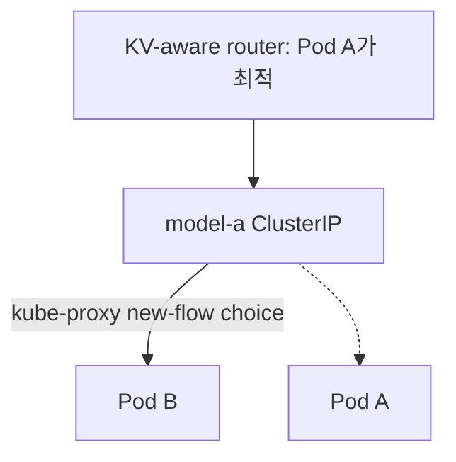
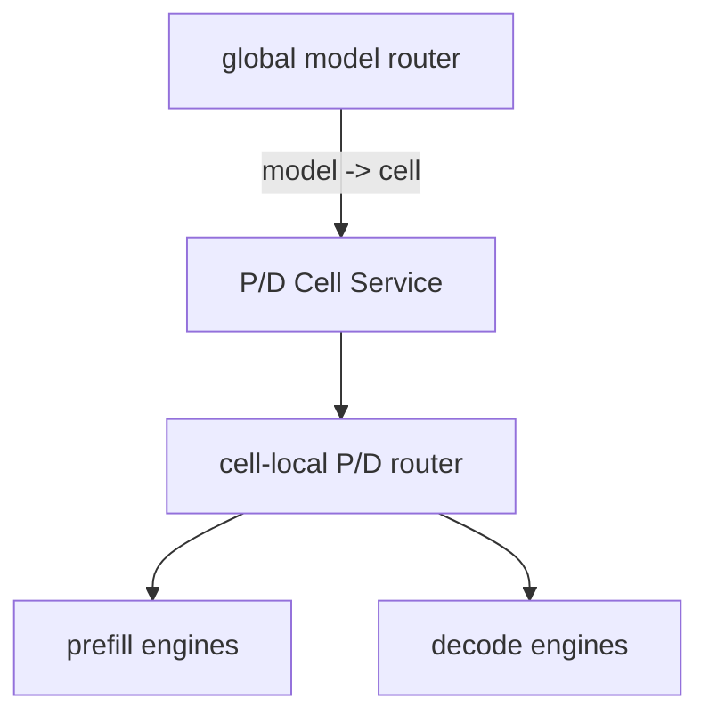

# L4/L7과 LLM Serving Routing

업데이트: 2026-09-02

## 1. L4와 L7이 보는 정보

| 계층/구성요소 | 볼 수 있는 대표 정보 | 할 수 있는 선택 | 볼 수 없는 정보의 예 |
|---|---|---|---|
| L4 Service/NAT | IP, port, protocol, flow | endpoint Pod, node-locality | HTTP path, `model`, prompt, tool |
| generic HTTP Gateway | host, method, path, header, query | API lane, version, tenant/header route | 보통 JSON body의 model/prompt 의미 |
| model router | HTTP + parsed request body | model backend, alias, replica | durable conversation state는 별도일 수 있음 |
| Agentic state tier | response/conversation/item graph | state resolve, rehydration, tool flow | engine별 live KV ownership은 별도 telemetry 필요 |
| inference-aware router | prompt tokens, queue/load, KV metadata | exact engine/Pod | durable state의 correctness를 대신하지 않음 |

Kubernetes Gateway API `HTTPRoute`의 표준 match는 path, header, method, query parameter 등을 다룬다. LLM JSON body의 `model`이나 prompt prefix를 기준으로 고르려면 inference extension 또는 application router가 필요하다. [Gateway API HTTP routing](https://gateway-api.sigs.k8s.io/guides/user-guides/http-routing/)을 참고한다.

## 2. Path routing과 model routing은 다른 결정이다

다음 아키텍처에서 Gateway는 API protocol lane을 고른다.

```text
/v1/completions
/v1/chat/completions  -> LiteLLM hosted_vllm lane

/v1/messages          -> Anthropic-compatible wrapper lane

/v1/responses         -> Agentic state lane
```

Agentic tier 뒤의 router는 `model`을 바탕으로 inference backend를 고른다.

```text
path = /v1/responses
  -> Agentic API
  -> reconstructed stateless Responses body
  -> model router
  -> model A / B / C
```

이 관심사 분리의 장점은 model name에 `-resp`, `-chat` 같은 protocol concern을 강제로 넣지 않아도 된다는 것이다. 다만 기존 provider wrapper가 model alias를 protocol selection에 사용한다면 migration 기간에는 명시적 alias contract가 필요할 수 있다.

## 3. “Service 수준 routing은 의미가 없다”의 정확한 범위

이 문장은 목적에 따라 판정이 달라진다.

| 목적 | L7 router → per-model ClusterIP Service | 판정 |
|---|---|---|
| model A와 model B 중 선택 | 각 Service가 해당 model만 가리킴 | **의미 있음** |
| tenant/policy별 Service 선택 | Service/namespace가 isolation boundary 일부 | **의미 있음** |
| model A replica 중 shortest queue 선택 | Service가 replica를 다시 선택 | **선택권 소실** |
| prefix/KV가 있는 exact replica 선택 | kube-proxy는 KV를 모름 | **불가능** |
| 특정 draining Pod 제외 | new connection은 제외 가능 | **부분 가능**, existing pool은 별도 |

따라서 정확한 문장은 다음이다.

> Service-level model routing은 유효하지만, multi-replica ClusterIP 뒤의 **Pod/engine-level cache-aware routing은 의미를 잃는다.**

## 4. 왜 KV-aware router 뒤의 ClusterIP가 문제인가

router가 KV hit를 계산해 Pod A를 선택했다고 하자. 실제 요청 destination이 `model-a.default.svc:80`이면 router가 선택한 것은 Pod A가 아니라 Service VIP다.



Pod A 선택을 보존하려면 request destination이 Pod A의 routable address여야 한다.

- EndpointSlice/Pod watch로 Pod IP를 직접 사용
- engine별 stable endpoint를 별도로 제공
- inference-aware Gateway/EPP가 exact endpoint를 반환

Kubernetes Gateway API Inference Extension도 일반 HTTP load balancing과 달리 model server의 queue, KV cache 같은 inference signal을 고려하는 Endpoint Picker 구조를 정의한다. [Gateway API Inference Extension](https://gateway-api-inference-extension.sigs.k8s.io/)을 참고한다.

## 5. Direct Pod routing의 대가

Pod IP direct routing은 kube-proxy의 마지막 선택을 제거하지만 router가 다음 책임을 인수한다.

- Kubernetes watch RBAC와 namespace scope
- EndpointSlice readiness/termination 반영
- Pod restart/IP churn과 connection pool eviction
- health check와 passive failure detection
- selected endpoint가 dispatch 전에 사라지는 race
- cross-node network policy와 routability
- endpoint별 TLS identity가 필요한 경우의 인증
- retry가 다른 Pod에서 KV miss/tool duplicate를 만들 수 있는 문제
- rolling drain과 in-flight request accounting

즉 “Service를 없애면 KV-aware가 된다”가 아니다. **정확한 endpoint selection과 lifecycle control을 application routing plane으로 옮기는 것**이다.

## 6. Persistent connection이 routing signal을 무력화하는 경우

router가 request마다 Pod를 다시 계산해도 HTTP client pool이 destination을 Service VIP 하나로만 알고 있으면 동일 TCP connection을 재사용한다. 반대로 destination key를 Pod IP로 분리하면 Pod별 pool을 유지할 수 있다.

| pool key | 실제 선택 granularity |
|---|---|
| `model-a.svc:80` | Service VIP connection 생성 시 Pod 선택 |
| `10.42.1.17:8000` | router가 exact Pod 선택 |
| HTTP/2 connection to Service | 모든 H2 stream이 선택된 동일 Pod |
| Pod별 HTTP/2 connection | router가 stream을 어느 Pod connection에 넣을지 결정 가능 |

Pod별 pool에서도 stale connection eviction, maximum age, GOAWAY/close 처리가 필요하다.

## 7. Agentic state와 KV affinity의 관계

Agentic tier가 `previous_response_id`를 full typed history로 rehydrate하면 downstream inference는 correctness 관점에서 stateless일 수 있다. 그러나 매 turn 전체 context를 다시 prefill하는 비용은 사라지지 않는다.

```text
durable state correctness
  = Agentic DB + rehydration

performance locality
  = same prefix -> same/live KV replica
```

두 계층을 분리하면 KV miss가 correctness failure가 아니라 latency/cost degradation이 된다. stable conversation ID나 prompt cache key는 affinity hint로 사용할 수 있지만, response ID는 turn마다 바뀔 수 있어 stable session key로 부적합할 수 있다.

## 8. P/D Cell의 이중 routing

P/D Cell에서는 외부/global routing과 cell 내부 P/D orchestration을 분리한다.



Agentic tier가 `previous_response_id`를 제거하고 reconstructed body를 보냈다면 global router는 state를 몰라도 된다. 그러나 cell 내부 router에는 여전히 다음 계약이 필요하다.

- `POST /v1/responses` endpoint를 accept
- Responses의 `max_output_tokens`를 P/D prefill request에 올바르게 처리
- original typed `input`, tools, reasoning fields를 decode request에 보존
- prefill 결과의 `kv_transfer_params`를 connector contract에 맞게 전달
- SSE event/status/error를 client-facing path까지 보존

즉 **state reconstruction은 P/D protocol compatibility를 대신하지 않는다.** global router가 opaque forwarding을 해도 cell-local router가 Chat/Completions 전용 `max_tokens` logic이면 Responses P/D는 깨질 수 있다.

## 9. 권고 serving topology

### 현재 correctness 우선

```text
Client
  -> L7 Gateway: path split
  -> Agentic API: durable state and rehydration
  -> thin model router: model filter, round-robin
  -> per-model Service or validated P/D Cell
```

### Pod-level KV-aware 단계

```text
Client
  -> L7 Gateway
  -> Agentic API
  -> inference-aware router
       watches EndpointSlice/Pods
       observes queue/KV/health
       keeps Pod-specific pools
  -> exact vLLM Pod/engine
```

edge Gateway, authentication, Agentic DB를 모두 뒤집을 필요는 없다. **router→inference backend edge만 Service VIP에서 direct endpoint discovery로 바꾸는 단계적 migration**이 가능하다.

## 10. 설계 검증 질문

1. 어느 component가 API path를 고르는가?
2. 어느 component가 model identity를 해석하는가?
3. exact Pod/engine을 고른 component와 실제 TCP destination이 같은가?
4. connection pool key가 Service인가 Pod인가?
5. EndpointSlice removal 뒤 existing connection은 누가 닫는가?
6. state correctness가 replica affinity에 의존하는가?
7. KV miss와 state loss를 metric/error에서 구분하는가?
8. P/D router가 사용하는 token-limit field와 endpoint별 schema가 맞는가?
