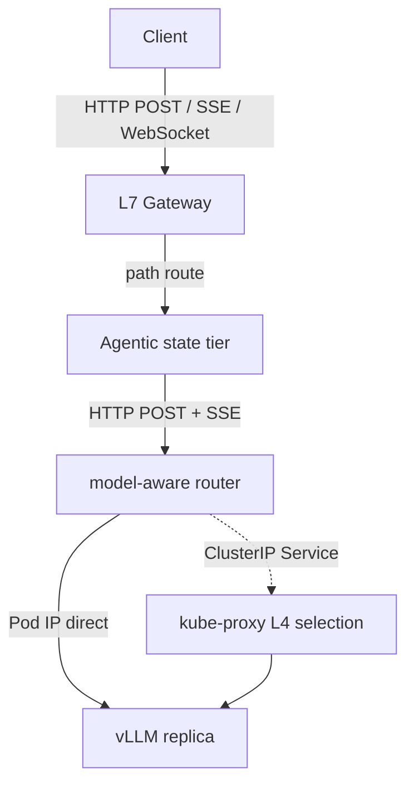

# HTTP Streaming and Kubernetes Routing

업데이트: 2026-09-02
범위: HTTP/SSE/WebSocket transport, Kubernetes Service/EndpointSlice, L4/L7, LLM serving routing

이 모듈은 다음 두 질문을 한 흐름으로 연결한다.

1. LLM client가 `stream=false`, SSE, WebSocket으로 호출할 때 wire 위에서 실제로 무엇이 달라지는가?
2. 그 연결이 Kubernetes Service와 L7 router를 통과할 때 어느 계층이 언제 backend를 선택하는가?

핵심은 **application request, application event, HTTP message, transport connection, IP packet의 경계를 구분하는 것**이다. 이 경계를 섞으면 “Service가 매 request를 round-robin한다”, “TCP chunk 하나가 token delta 하나다”, “SSE retry는 안전하다” 같은 잘못된 운영 가정이 생긴다.

## 권장 읽기 순서

| 순서 | 문서 | 핵심 질문 |
|---:|---|---|
| 1 | [Protocol stack과 경계](00-protocol-stack-and-boundaries.md) | HTTP, SSE, WebSocket은 같은 층의 protocol인가? |
| 2 | [HTTP request/response와 streaming](01-http-request-response-and-streaming.md) | non-stream과 stream은 connection·body 관점에서 어떻게 다른가? |
| 3 | [SSE deep dive](02-sse-deep-dive.md) | delta event가 TCP/HTTP chunk와 왜 일치하지 않는가? |
| 4 | [WebSocket deep dive](03-websocket-deep-dive.md) | full-duplex persistent session은 무엇을 보장하고 무엇을 보장하지 않는가? |
| 5 | [Kubernetes Service와 EndpointSlice](10-kubernetes-service-endpoints.md) | ClusterIP가 Pod를 선택하는 실제 시점과 단위는 무엇인가? |
| 6 | [L4/L7과 LLM serving routing](11-l4-l7-llm-serving-routing.md) | model routing과 replica/KV-aware routing을 어디서 해야 하는가? |
| 7 | [관측·실험·장애 주입](12-observability-and-labs.md) | 가정을 packet, conntrack, EndpointSlice, access log로 어떻게 증명하는가? |
| 8 | [용어집과 공식 자료](99-glossary-and-references.md) | 용어와 normative/reference source는 무엇인가? |

## 먼저 기억할 다섯 문장

1. **SSE는 HTTP와 경쟁하는 별도 transport가 아니라, 하나의 HTTP response body 안에서 event를 구분하는 text format이다.**
2. **LLM delta, SSE event, HTTP/1.1 chunk, HTTP/2 DATA frame, TCP segment는 서로 다른 경계다.** proxy와 kernel은 이 경계를 분할하거나 합칠 수 있다.
3. **WebSocket은 persistent full-duplex framed channel을 제공하지만 delivery 보장, replay, idempotency, exactly-once를 자동으로 제공하지 않는다.**
4. **일반 Kubernetes ClusterIP Service는 HTTP path나 JSON body를 보지 않는 L4 virtual service다.** kube-proxy iptables mode에서는 새 connection의 packet이 처음 들어올 때 DNAT backend가 정해지고 conntrack이 그 flow를 유지한다.
5. **L7 router가 Pod가 아니라 multi-replica ClusterIP Service를 호출하면 model/service 선택은 유효하지만 Pod 단위 KV-aware 선택권은 kube-proxy에 넘긴다.**

## LLM serving에 적용한 전체 지도

- Client-facing WebSocket이 있어도 내부 hop 전체가 WebSocket일 필요는 없다.
- Gateway는 HTTP method/path/header와 Upgrade를 기준으로 L7 분기한다.
- Agentic tier는 state resolve·rehydration을 담당한다.
- model router는 request의 `model`과 선택적으로 prompt/cache/load 정보를 본다.
- ClusterIP로 내려가면 최종 Pod 선택은 L4 connection 단위가 되며, model router가 의도한 Pod 단위 판단은 소실된다.

## 적용 범위

문서는 Linux/Kubernetes의 대표적인 kube-proxy iptables path를 기준으로 설명한다. IPVS, nftables, eBPF dataplane에서도 **Service VIP가 L4 flow를 backend endpoint로 변환한다**는 상위 개념은 같지만 rule 구조와 selection algorithm, observability command는 달라질 수 있다. 실제 cluster의 kube-proxy/CNI mode를 먼저 확인한다.
