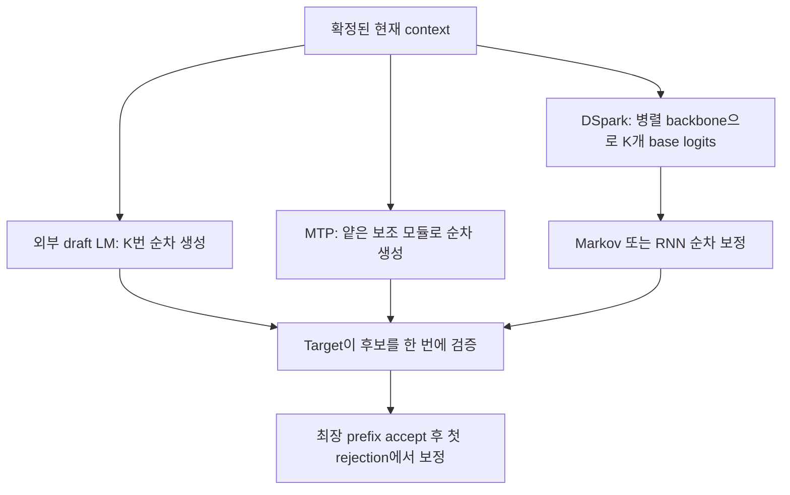
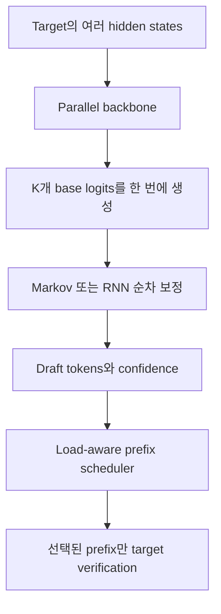

# Speculative Decoding: 전통 SD, MTP, DFlash, DSpark의 구조적 차이

작성일: 2026-08-18
분류: `study/speculative-decoding`
범위: 개념, 알고리즘, 학습 관계, 런타임 비용, 주요 방법론 분류

## 1. 이 문서의 목표

Speculative Decoding(SD)은 흔히 "작은 모델이 미리 생성하고 큰 모델이 확인한다"로 설명된다. 이 설명만으로는 전통적인 외부 draft model, MTP, Medusa, EAGLE, DFlash, DSpark의 차이를 구분하기 어렵다.

이 문서는 각 방법을 다음 네 질문으로 분해한다.

1. 후보 token은 어디에서 만들어지는가?
2. 후보 K개를 만드는 계산은 순차적인가, 병렬적인가?
3. draft는 target과 함께 학습됐는가, target을 고정한 뒤 별도로 학습됐는가?
4. target은 어떤 후보를 얼마나 검증하는가?

모델별 checkpoint 구조와 vLLM 버전별 구현 차이는 다음 문서에서 별도로 다룬다.

- [vLLM SD Token Budget Deep Dive — MBT, scheduled tokens, method별 draft slots](2026-09-03-vllm-speculative-decoding-token-budget-deep-dive.md)
- [DeepSeek-V4 DSpark checkpoint와 vLLM 구현](../../models/deepseek-v4/2026-08-18-dspark-checkpoint-and-vllm-implementation.md)
- [vLLM 0.27.x DeepGEMM SM90 CUDA IMA 분석](../../models/deepseek-v4/2026-08-18-vllm-0.27-deepgemm-sm90-cuda-ima.md)

---

## 2. SD를 관통하는 성능 식

Autoregressive decoding은 target model을 한 번 실행할 때 확정 token을 보통 하나만 만든다. SD는 값싼 proposer가 여러 후보를 만든 뒤 target이 한 번에 검증하게 하여, 한 번의 비싼 target 실행에서 여러 token을 확정하려는 기법이다.

평균 token latency는 다음과 같이 볼 수 있다.

```math
L_{token}
\approx
\frac{T_{draft}+T_{verify}}
{\mathbb{E}[\text{한 cycle에서 commit되는 token 수}]}
```

따라서 모든 SD 최적화는 결국 다음 세 축에 속한다.

- `T_draft` 감소: 후보를 더 빨리 만든다.
- accepted length 증가: target이 받아줄 후보를 더 잘 만든다.
- `T_verify`의 기회비용 감소: 받아들여질 가능성이 낮은 후보는 검증하지 않는다.



중요한 결론은 다음과 같다.

> SD 방법론의 핵심 차이는 target verifier보다 **후보를 어떻게 생성하고, 어떤 후보를 verifier에 입장시키는가**에 있다.

---

## 3. 전통적인 별도 draft model 방식

### 3.1 기본 동작

target model의 분포를 $p$, draft model의 분포를 $q$라고 하자.

1. 작은 draft LM이 KV cache를 사용해 후보 $x_1, \ldots, x_K$를 autoregressive하게 생성한다.
2. target은 이 K개 후보 위치를 한 번의 forward pass로 점수화한다.
3. 위치 $k$의 draft token은 다음 확률로 accept된다.

```math
P(accept\;x_k)=\min\left(1,\frac{p_k(x_k)}{q_k(x_k)}\right)
```

4. 첫 rejection이 발생하면 뒤쪽 suffix는 모두 버린다.
5. residual distribution에서 correction token을 생성하고 다음 cycle로 넘어간다.

올바른 modified rejection sampling을 사용하면 target distribution을 보존한다. sampling 환경에서 `lossless`는 같은 난수로 항상 동일한 문자열이 나온다는 의미가 아니라, 최종 출력의 확률분포가 target 단독 sampling과 같다는 의미다.

### 3.2 비용 구조

- draft가 작은 모델이어도 K개 후보는 K번의 순차 forward가 필요하다.
- draft model의 weight와 KV cache가 별도로 필요하다.
- target과 tokenizer 또는 vocabulary mapping이 맞아야 한다.
- draft가 너무 작으면 acceptance가 낮아지고, 너무 크면 `T_draft`가 커져 가속 이득이 사라진다.

즉 전통 SD의 핵심 trade-off는 `draft 속도`와 `target 정렬도` 사이에 있다.

---

## 4. DeepSeek 계열 MTP

### 4.1 MTP는 먼저 학습 목적이다

Multi-Token Prediction(MTP)은 한 위치에서 next token 하나만 예측하는 대신 여러 미래 token을 예측하도록 학습 신호를 추가한다.

목적은 두 가지다.

- 하나의 sequence에서 더 조밀한 학습 신호를 얻는다.
- main model이 단기 미래를 고려하는 표현을 만들도록 유도한다.

따라서 checkpoint에 MTP weight가 있다는 사실과, 추론 시 MTP SD가 활성화됐다는 사실은 별개다. MTP module은 추론에서 제거할 수도 있고, speculative drafter로 재사용할 수도 있다.

### 4.2 DeepSeek MTP는 독립 parallel head가 아니다

DeepSeek-V3 방식은 미래 offset별 독립 head를 한 번에 실행하는 구조가 아니라 causal chain을 유지하는 순차 MTP module이다.

$k$번째 module은 main 또는 이전 MTP depth의 hidden state와 다음 입력 token embedding을 결합한다.

```math
h_i^k=
\mathrm{TRM}_k\left(
M_k[
\mathrm{Norm}(h_i^{k-1});
\mathrm{Norm}(\mathrm{Emb}(t_{i+k}))
]
\right)
```

embedding과 output head는 main model과 공유한다.

추론에서 MTP를 drafter로 사용하면 이전에 sampled된 token을 다음 얕은 module 실행에 넣어 후보를 순차적으로 확장한다. 따라서 외부 full draft LM보다 훨씬 가볍지만, K가 커질수록 draft 단계의 순차성도 증가한다.

### 4.3 외부 draft model과의 차이

| 구분 | 외부 draft LM | DeepSeek MTP |
|---|---|---|
| 모델 관계 | 독립적인 작은 LM | target에 정렬된 보조 module |
| 학습 | 기존 sibling을 사용하거나 별도 distillation | 보통 target pretraining과 MTP loss로 함께 학습 |
| shared component | 일반적으로 없음 | embedding, LM head, target representation 활용 |
| 후보 생성 | 작은 LM을 K번 순차 실행 | 얕은 MTP module을 순차 실행 |
| 추가 메모리 | full draft weights와 KV | 작은 module weights와 draft state/KV |
| 이식성 | compatible model끼리 조합 가능 | checkpoint와 framework 구현에 강하게 종속 |

---

## 5. DFlash: 병렬 block drafter

DFlash는 target의 hidden feature를 context로 받아 여러 draft 위치를 한 번의 block-diffusion forward에서 병렬로 예측한다.

전통 AR drafter가 K개 후보를 위해 K번 순차 실행되는 것과 달리, DFlash의 무거운 draft 계산은 block 크기가 커져도 대체로 한 번이다.

### 장점

- 큰 K에서도 `T_draft` 증가가 작다.
- target hidden feature와 KV injection을 활용해 작은 독립 LM보다 강한 context를 사용할 수 있다.
- drafting 단계의 GPU 병렬성을 높인다.

### 구조적 약점: suffix decay

각 block 위치가 서로의 실제 sampled token을 모른 채 병렬로 예측되면, 여러 가능한 continuation mode가 섞일 수 있다.

```text
가능한 continuation:  "of course" / "no problem"
독립 병렬 예측 결과: "of problem" / "no course"
```

첫 위치는 잘 맞더라도 뒤쪽 위치의 조건부 일관성이 빠르게 떨어진다. SD는 첫 rejection 뒤의 모든 suffix를 버리므로 후반부 품질 저하는 accepted length를 크게 감소시킨다.

---

## 6. DSpark: parallel draft와 local autoregression의 결합

DSpark는 DFlash 계열의 병렬 backbone에 작은 순차 correction head를 붙인 semi-autoregressive drafter다. 여기에 confidence head와 hardware-aware scheduler를 결합해 verification budget까지 조절한다.



DSpark는 다음 두 문제를 각각 해결한다.

1. `draft better`: 병렬 backbone 뒤에 값싼 순차 dependency를 추가해 suffix decay를 줄인다.
2. `verify smarter`: request별 prefix survival probability와 현재 engine의 capacity curve를 이용해 검증 길이를 정한다.

### 6.1 Markov head

병렬 backbone이 위치 $k$의 base logits $U_k$를 만든 뒤, 직전 draft token으로부터 transition bias를 계산한다.

```math
p_k(v)=\mathrm{softmax}\left(U_k(v)+B(x_{k-1},v)\right)
```

전체 vocabulary-to-vocabulary 전이행렬을 저장하면 $V^2$가 필요하므로 low-rank factorization을 사용한다.

```math
B(x_{k-1},\cdot)=W_1[x_{k-1}]W_2
```

- $W_1$: 직전 token의 Markov embedding lookup
- $W_2$: low-rank embedding을 vocabulary logit bias로 projection
- 순차 loop는 존재하지만, transformer/MoE backbone을 K번 돌리는 것보다 훨씬 싸다.

Markov head가 직전 token만 사용한다는 사실은 DSpark 전체가 단순 bigram model이라는 뜻이 아니다. $U_k$는 target의 깊은 hidden context와 병렬 draft backbone에서 만들어진다. Markov head는 이미 context-rich한 base logits에 block 내부의 국소적 조건부 일관성을 추가한다.

### 6.2 RNN head

RNN 변형은 block 내부의 전체 prefix를 recurrent state에 누적한다.

- 장점: $x_{k-1}$보다 오래된 draft history도 사용할 수 있다.
- 단점: state 관리와 배포 구현이 복잡해진다.
- DSpark 논문 결과: 긴 block에서 일부 이득은 있으나 Markov 대비 개선이 작아 Markov를 기본값으로 채택했다.

따라서 `DSpark-Markov`는 파일 형식이 아니다.

> DSpark라는 전체 framework에서 순차 correction module로 low-rank 1차 Markov head를 사용한 기본 변형을 의미한다.

### 6.3 Confidence head와 prefix scheduler

confidence head는 각 위치의 conditional acceptance probability를 예측한다.

```math
c_k=P(x_k\text{가 accept}\mid x_1,\ldots,x_{k-1}\text{가 모두 accept})
```

prefix $1\ldots j$가 모두 살아남을 확률은 다음 누적곱이다.

```math
a_j=\prod_{i=1}^{j}c_i
```

scheduler는 request별 prefix extension을 $a_j$ 기준으로 평가하고, profiling한 target step-per-second 또는 cost curve와 결합해 기대 throughput이 증가하는 범위까지만 verification slot을 배정한다.

이 기능이 중요한 이유는 extra verification token의 비용이 load에 따라 달라지기 때문이다.

- 저동시성: target은 memory-bound이고 여유 compute가 있어 추가 검증 비용이 작다.
- 고동시성: rejected token도 batch capacity를 차지하므로 aggregate throughput을 낮출 수 있다.

고정 K 하나로 모든 concurrency를 최적화하기 어려운 이유다.

---

## 7. 핵심 방식 비교

| 방식 | 후보 생성 | target과의 학습 관계 | K에 따른 draft 순차성 | 추가 weight/KV | 대표 병목 |
|---|---|---|---|---|---|
| Classic external draft | 작은 full LM | 독립 또는 별도 distillation | K번 AR 실행 | 큼 | draft 크기와 acceptance trade-off |
| DeepSeek MTP | 얕은 target-aligned module | main training과 결합 | K에 따라 순차 실행 증가 | 작음 | 긴 K에서 draft latency 증가 |
| Medusa | 여러 미래-token head | frozen target 위 head 학습 또는 joint tuning | head는 병렬 | 작음 | 독립 head의 conditional dependency 부족 |
| EAGLE-3 | target feature를 쓰는 얕은 AR drafter | target별 별도 학습 | AR rollout | 중간 | target-specific training과 draft loop |
| DFlash | block-diffusion parallel backbone | frozen target feature로 학습 | 무거운 계산 1회 | 중간 | 후반 위치 suffix decay |
| DSpark-Markov | parallel backbone + 저비용 Markov loop | target freeze 후 draft 학습 | backbone 1회 + 값싼 K-step bias | 중간 | 구현 복잡도, fixed-K verification 비용 |
| Prompt lookup / n-gram | prompt 또는 이전 output 검색 | 학습 없음 | 검색 중심 | 매우 작음 | 반복이 적은 open-ended 생성에서 낮은 hit |
| LayerSkip | target의 early layer | 전용 training recipe | early-exit draft | 별도 model 없음 | checkpoint 제약, exit 정확도 |

---

## 8. 다른 주요 SD 방법론

### 8.1 Medusa와 Hydra

Medusa는 target model에 여러 decoding head를 추가해 서로 다른 미래 offset을 병렬 예측하고, candidate tree를 target이 한 번에 검증한다.

- Medusa-1: target을 freeze하고 head만 학습
- Medusa-2: target과 head를 함께 fine-tune
- 장점: 별도 full draft model이 필요 없다.
- 약점: 독립 head는 앞선 실제 sampled token에 조건화되지 않는다.

Hydra는 뒤쪽 head가 앞쪽 head의 결과를 조건으로 사용하게 하여 Medusa의 독립성 문제를 완화한다.

### 8.2 EAGLE-3

EAGLE 계열은 token 확률만 모방하는 대신 target hidden feature를 사용하는 target-specific drafter다. EAGLE-3는 target의 low/mid/high layer feature를 융합하고, training-time test 방식으로 실제 autoregressive rollout 중 발생하는 distribution shift를 학습에 반영한다.

높은 acceptance와 candidate tree 구성이 장점이지만, target별 draft checkpoint 학습과 AR rollout이 필요하다.

### 8.3 Prompt lookup, n-gram, suffix decoding

별도 neural drafter 없이 prompt 또는 이미 생성한 token sequence에서 일치하는 n-gram/suffix를 찾고 그 다음 span을 후보로 복사한다.

다음 workload에서 특히 유리하다.

- 주어진 문서를 다시 인용하거나 요약하는 작업
- 기존 코드를 수정하면서 원문을 많이 복사하는 작업
- 반복적인 형식 또는 template 생성

open-ended chat처럼 prompt에 정답 continuation이 거의 없으면 효과가 제한적이다.

### 8.4 LayerSkip과 self-speculative decoding

동일한 target model의 early layer에서 먼저 token을 제안하고, 남은 layer가 검증한다.

- 별도 full draft weight가 필요 없다.
- 일부 activation과 KV를 공유할 수 있다.
- early exit 정확도를 높이는 전용 학습 recipe와 checkpoint가 필요하다.

### 8.5 Tree verification은 별도 축이다

Medusa tree, SpecInfer, Sequoia 등은 하나의 chain만 제안하는 대신 여러 branch를 target의 tree attention으로 함께 검증한다.

이것은 후보 생성원의 종류와 직교한다. EAGLE 같은 drafter가 tree를 만들 수도 있고, multi-head가 tree를 만들 수도 있다.

- 장점: target이 accept할 branch가 tree 안에 존재할 확률 증가
- 단점: 검증 token 수와 attention metadata가 증가하고, 고동시성에서 batch capacity를 더 소비할 수 있음

---

## 9. 운영에서 SD가 항상 이득이 아닌 이유

SD는 주로 decode phase의 memory-bound 특성을 이용한다. batch가 작을 때 target은 weight를 읽는 동안 GPU compute가 남으므로 여러 후보 위치를 함께 계산해도 추가 latency가 작을 수 있다.

batch와 concurrency가 커지면 상황이 달라진다.

- target verification token이 실제 사용자 token과 compute/batch capacity를 경쟁한다.
- rejected suffix도 target forward에 포함됐다면 비용을 이미 지불한 상태다.
- 사용자별 ITL은 좋아져도 aggregate output throughput과 queue latency는 악화될 수 있다.

또한 SD는 일반적으로 prompt prefill을 줄이지 않는다. 긴 입력과 짧은 출력이 지배적인 workload에서는 전체 요청 latency 중 SD가 줄일 수 있는 비율 자체가 작다.

### 필수 관측 지표

- 위치별 conditional acceptance
- drafted token 수와 accepted draft token 수
- cycle당 실제 commit token 수
- draft latency와 target verification latency
- per-user output tokens/s
- aggregate output tokens/s
- p50/p99 inter-token latency와 queue latency
- HBM 사용량과 draft KV 규모
- context length, domain, reasoning mode별 분리 결과

### 권장 비교군

```text
Target only
MTP-1
DSpark K=5
DSpark K=7
DSpark adaptive verification
Prompt lookup 또는 n-gram  # 반복 workload가 있을 때
```

같은 K라도 code, math, open-ended chat, reasoning mode에 따라 acceptance가 크게 다를 수 있으므로 하나의 synthetic dataset 결과만으로 운영 결론을 내리면 안 된다.

---

## 10. 본질적인 구분

다음 문장으로 각 방식을 구분할 수 있다.

- 전통 SD: **작은 독립 LM이 먼저 여러 token을 순차 생성한다.**
- MTP SD: **target과 함께 학습된 얕은 보조 module이 target-aligned draft를 순차 생성한다.**
- DFlash: **무거운 draft 계산을 병렬 block 한 번으로 바꾼다.**
- DSpark-Markov: **병렬 block draft에 값싼 직전-token 조건부 보정을 추가한다.**
- 완전한 DSpark: **DSpark-Markov에 confidence 기반 load-aware verification까지 더한다.**

> 본질적으로 SD는 target model을 근사 모델로 교체하는 기술이 아니라, 값싼 추측을 이용해 비싼 target 호출 한 번에서 확정하는 token 수를 늘리는 실행 전략이다.

---

## 11. 주요 원문

- Leviathan et al., [Fast Inference from Transformers via Speculative Decoding](https://arxiv.org/abs/2211.17192)
- Chen et al., [Accelerating Large Language Model Decoding with Speculative Sampling](https://arxiv.org/abs/2302.01318)
- DeepSeek-AI, [DeepSeek-V3 Technical Report - Multi-Token Prediction](https://arxiv.org/html/2412.19437v1#S2.SS2)
- Cai et al., [Medusa](https://arxiv.org/abs/2401.10774)
- Li et al., [EAGLE-3](https://arxiv.org/abs/2503.01840)
- Chen et al., [DFlash](https://arxiv.org/abs/2602.06036)
- Cheng et al., [DSpark](https://arxiv.org/abs/2607.05147)
- DeepSeek-AI, [DeepSpec](https://github.com/deepseek-ai/DeepSpec)
- Elhoushi et al., [LayerSkip](https://arxiv.org/abs/2404.16710)
- Saxena, [Prompt Lookup Decoding](https://github.com/apoorvumang/prompt-lookup-decoding)
