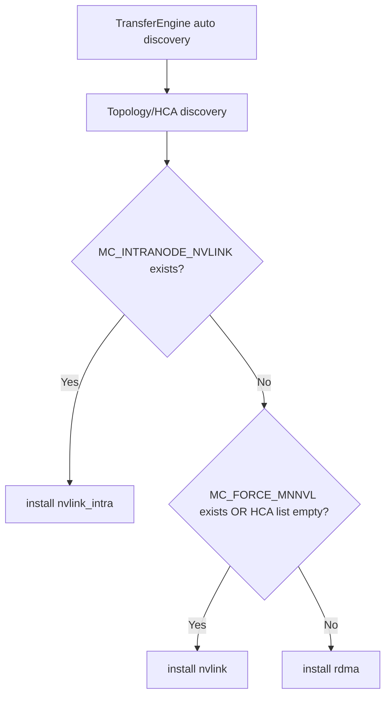
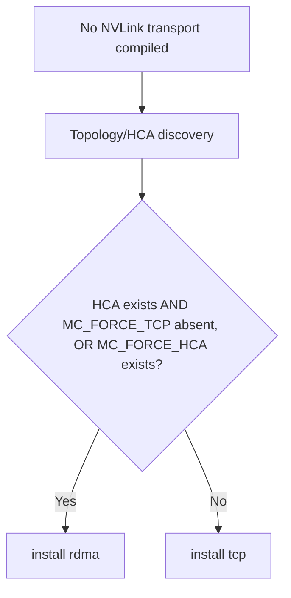
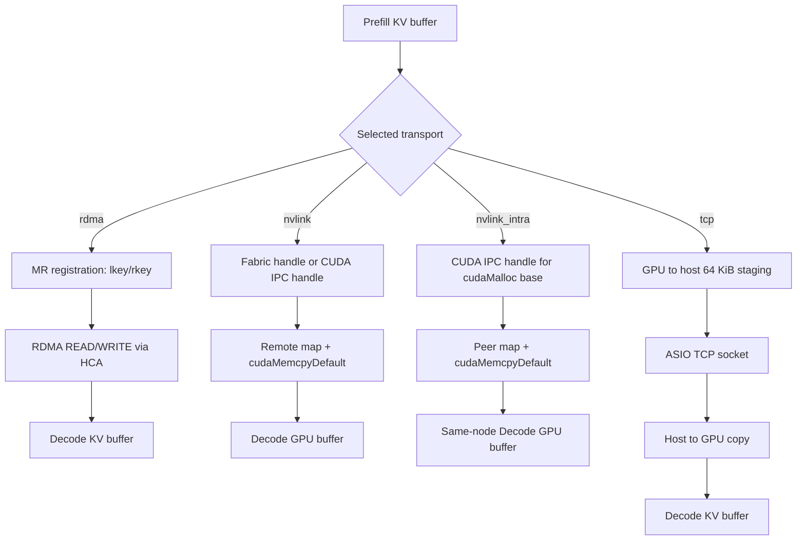

# Mooncake 0.3.10.post2 폐쇄망 Source Build와 Transport 선택

작성일: 2026-08-24  
최종 갱신: 2026-08-25

## 1. 결론과 현재 상태

vLLM image 안에서 `mooncake-transfer-engine==0.3.10.post2`를 source build하여
다음 기능을 포함한 CUDA 12.9 image 생성에 성공했다.

- `USE_CUDA=ON`
- `USE_MNNVL=ON` → `nvlink`
- `USE_INTRA_NVLINK=ON` → `nvlink_intra`
- `USE_TCP=ON`
- Transfer Engine만 사용하고 Store/etcd/Rust/Go 경로는 제외

실제 내부 build 기준선은 다음과 같다.

| 항목 | 검증 값 |
|---|---|
| vLLM base | `vllm/vllm-openai:v0.26.0-cu129` 계열 |
| Python | 3.12 |
| CUDA toolkit | 12.9 |
| Mooncake | `0.3.10.post2` |
| build network | 사내 APT/pip proxy와 CA 사용 |
| 외부 수동 반입 | Mooncake source와 채워진 submodule archive |
| image build | 성공 |
| 실제 P/D KV transfer | PR #4에서 검증 예정 |

이 문서에서 image build 성공과 transport runtime 성공을 구분한다. wheel 생성,
설치, import가 성공했더라도 GPU KV가 의도한 transport를 사용했다는 뜻은 아니다.

---

## 2. 공식 wheel을 그대로 사용할 수 없었던 이유

Mooncake `v0.3.10.post2`의 공식 release workflow 경로는
`.github/workflows/release.yaml`이 맞다. 이 workflow의 CMake configure에는
`USE_CUDA=ON`이 있지만 다음 두 옵션은 전달되지 않는다.

```text
USE_MNNVL=OFF          # default
USE_INTRA_NVLINK=OFF   # default
```

`mooncake-common/common.cmake`에서 두 옵션의 기본값은 `OFF`다.
`multi_transport.cpp`도 각각의 compile definition이 있을 때만 구현체를 포함한다.

```text
USE_MNNVL=ON
  -> USE_MNNVL compile definition
  -> NvlinkTransport 포함
  -> installTransport("nvlink") 가능

USE_INTRA_NVLINK=ON
  -> USE_INTRA_NVLINK compile definition
  -> IntraNodeNvlinkTransport 포함
  -> installTransport("nvlink_intra") 가능
```

따라서 `USE_CUDA=ON` 또는 별도의 `nvlink_allocator.so` 생성만으로 두 transport가
wheel에 포함되지는 않는다. 해당 protocol을 지정해도 구현체가 컴파일되지 않았다면
`Unsupported transport ..., please rebuild Mooncake` 경로로 실패한다.

---

## 3. 폐쇄망 build에서 확인된 수정사항

### 3.1 사내 repository와 CA

builder와 runtime이 같은 `configured-base`를 상속한다.

```dockerfile
COPY certs/ /opt/certs/
COPY pip.conf /etc/pip.conf
COPY sources.list /etc/apt/sources.list
```

- `certs/*.crt`는 `/usr/local/share/ca-certificates/`로 복사한 뒤
  `update-ca-certificates`를 실행한다.
- base image에 남은 외부 APT list가 사내 mirror와 섞이지 않도록
  `/etc/apt/sources.list.d/*.list`를 제거한다.
- Python build dependency는 `pip.conf`의 사내 proxy에서 설치한다.
- Ubuntu/CUDA package는 `sources.list`의 사내 proxy에서 설치한다.
- 실제 CA, repository 주소, credential은 공개 저장소에 저장하지 않는다.

### 3.2 `libc6-bin` 대신 `libc6`

내부 APT repository에서 `libc6-bin` 설치가 실패하여 package 조회 결과에 맞춰
`libc6`로 수정했다. 이는 Ubuntu 전체에 대한 일반 결론이 아니라 현재 사내
repository에서 실제 build를 통과한 입력값이다.

### 3.3 CUDA stub link path

Mooncake CMake/build 단계의 CUDA driver link 오류는 다음 경로를 compiler의
library 검색 경로에 추가하여 해결했다.

```dockerfile
ENV LIBRARY_PATH=/usr/local/cuda/lib64/stubs:${LIBRARY_PATH}
```

CUDA image 안의 `libcuda.so`는 실제 driver가 아니라 link용 stub이다. image build
시점에는 host NVIDIA driver가 mount되지 않으므로 linker가 stub을 찾아야 한다.

```text
compile/link time
  Mooncake object
    -> LIBRARY_PATH
      -> /usr/local/cuda/lib64/stubs/libcuda.so

GPU Pod runtime
  Mooncake engine.so
    -> NVIDIA container runtime mount
      -> host driver의 실제 libcuda.so.1
```

stub 경로는 `LIBRARY_PATH`에만 둔다. `LD_LIBRARY_PATH`에 넣어 runtime에서 stub을
우선 load하게 만들면 안 된다.

### 3.4 수동 source closure

외부에서 실제 반입하는 것은 다음 source closure다.

```text
mooncake-offline_0.3.10.post2.tar.gz
└── Mooncake/
    ├── Mooncake 0.3.10.post2 source
    └── extern/
        ├── pybind11/       # 실제 source가 채워진 상태
        └── yalantinglibs/  # 실제 source가 채워진 상태
```

일반 GitHub source archive는 submodule 본문이 비어 있으므로 두 submodule archive를
각각 받아 `extern/`의 정확한 경로에 배치한 뒤 하나의 tarball로 묶는다.

---

## 4. vLLM 설정에서 실제 transport까지

### 4.1 vLLM이 넘기는 값

vLLM `0.27.1` MooncakeConnector 기준으로 다음 값을 읽는다.

```python
protocol = kv_connector_extra_config.get("mooncake_protocol", "rdma")
device_name = kv_connector_extra_config.get("device_name", "")
engine.initialize(hostname, "P2PHANDSHAKE", protocol, device_name)
```

즉 `mooncake_protocol`의 vLLM 기본값은 `rdma`이고 `device_name`은 HCA discovery
filter로 전달된다.

### 4.2 protocol 인자와 실제 transport는 같은 결정이 아니다

Mooncake `0.3.10.post2` Python binding의 `protocol` 인자는 먼저 memory allocator를
정한다.

| protocol 인자 | Python binding allocator |
|---|---|
| `nvlink` | MNNVL/Fabric memory allocator |
| `nvlink_intra` | Intra-node NVLink allocator |
| `rdma`, `tcp`, 기타 | 기본 `malloc/free` |

그 다음 `TransferEngine(true, device_filter)`가 topology를 자동 탐색하고,
`transfer_engine_impl.cpp`가 compile flag, 환경변수 존재 여부, HCA 발견 결과로
실제 설치 transport를 선택한다.

따라서 vLLM log의 다음 문장은 **요청 protocol**을 뜻할 뿐이다.

```text
The Mooncake Transfer Engine is using <protocol> as its protocol.
```

실제 설치된 transport는 Mooncake log와 원격 segment metadata의 `protocol`로
판정해야 한다. `MultiTransport::selectTransport()`는 target segment가 광고한
protocol에 대응하는 설치 transport를 선택한다.

### 4.3 현재 NVLink-enabled build의 정확한 선택 로직

현재 image는 `USE_MNNVL=ON`과 `USE_INTRA_NVLINK=ON`을 모두 사용한다.



환경변수는 문자열 값이 아니라 **존재 여부**로 판정한다.

- `MC_INTRANODE_NVLINK=0`도 `nvlink_intra`를 선택한다.
- `MC_FORCE_MNNVL=0`도 `nvlink`를 선택한다.
- 비활성화하려면 환경변수 자체를 제거해야 한다.
- 두 변수가 모두 존재하면 `MC_INTRANODE_NVLINK`가 우선한다.

### 4.4 TCP fallback에 대한 중요한 예외

현재 build에서는 자동 선택의 마지막 fallback이 TCP가 아니다.

`transfer_engine_impl.cpp`의 TCP 분기는 다음 compile-time 조건에서만 실행된다.

```text
USE_MNNVL=OFF AND USE_INTRA_NVLINK=OFF
```

이 별도 build의 선택은 다음과 같다.



따라서 현재 image에서 `USE_TCP=ON`은 TCP 구현체가 컴파일된다는 뜻이지,
NVLink/RDMA 선택 실패 시 TCP가 자동 설치된다는 뜻은 아니다. 현재 image의 자동
경로는 `nvlink_intra / nvlink / rdma` 중 하나다. TCP 자동 fallback이 필요하면
별도 build profile 또는 upstream 선택 로직 변경이 필요하다.

### 4.5 PR #4에 넘길 일관된 조합

| 목표 | `mooncake_protocol` | 환경변수 | 장치 조건 | 실제 선택 기대값 |
|---|---|---|---|---|
| Network B 동일 node | `nvlink_intra` | `MC_INTRANODE_NVLINK=1` | GPU P2P/NVLink | `nvlink_intra` |
| MNNVL fabric | `nvlink` | `MC_FORCE_MNNVL=1` | MNNVL/Fabric memory | `nvlink` |
| Network A RDMA | `rdma` | 위 NVLink env 모두 제거 | HCA visible/discovered | `rdma` |
| TCP 전용 별도 image | `tcp` | `MC_FORCE_TCP=1` | NVLink flags OFF | `tcp` |

`device_name`을 잘못 제한해 HCA list가 비면 현재 image는 RDMA가 아니라 `nvlink`를
선택한다. vLLM log만 보면 `rdma`로 보일 수 있으므로 Mooncake log를 반드시 함께
확인한다.

---

## 5. Transport별 실제 데이터 경로

### 5.1 전체 비교



### 5.2 RDMA

```text
GPU/host buffer registration
  -> ibverbs MR registration
  -> lkey/rkey와 buffer metadata 게시
  -> source/target HCA context와 endpoint/QP 선택
  -> request를 slice로 분할
  -> one-sided RDMA READ/WRITE
  -> completion polling
```

- GPU memory가 `nvidia-peermem`/GPUDirect RDMA 조건으로 등록되면 NIC가 VRAM에
  직접 접근하여 CPU staging을 피한다.
- HCA visibility, memlock, verbs device, GID/port, peer connectivity가 모두 필요하다.
- 여러 HCA context에 memory region을 등록하고 각 context의 lkey/rkey를 metadata에
  기록한다.
- Network A의 cross-node P/D 후보 경로다.

### 5.3 `nvlink` / MNNVL

`NvlinkTransport`는 모든 visible GPU가 CUDA Fabric Memory handle을 지원하고
`MC_USE_NVLINK_IPC`가 없으면 Fabric Memory 경로를 사용한다.

```text
cuMem allocation
  -> CUmemFabricHandle export
  -> handle을 segment metadata로 전달
  -> peer가 handle import
  -> VA reserve/map/access 설정
  -> cudaMemcpyDefault
  -> MNNVL fabric가 실제 GPU copy 수행
```

Fabric Memory를 사용할 수 없거나 `MC_USE_NVLINK_IPC`가 있으면 CUDA IPC handle
경로로 내려간다. CUDA IPC는 본질적으로 same-node process 공유용이므로 단순
H200 NVSwitch 단일 node를 MNNVL로 해석해서는 안 된다. cross-node `nvlink`는
실제 MNNVL fabric과 Fabric Memory 지원을 별도로 증명해야 한다.

### 5.4 `nvlink_intra`

```text
PyTorch KV tensor address
  -> cuMemGetAddressRange로 실제 cudaMalloc base/size 확인
  -> cudaIpcGetMemHandle
  -> handle과 base address를 metadata에 게시
  -> peer가 cudaIpcOpenMemHandle(...LazyEnablePeerAccess)
  -> target offset을 peer VA로 재배치
  -> cudaMemcpyDefault
  -> CUDA P2P가 NVLink/NVSwitch 경로 사용
```

- framework caching allocator의 sub-allocation 때문에 tensor pointer가 아니라 실제
  cudaMalloc allocation 단위로 등록한다.
- 같은 node의 process 사이 CUDA IPC가 전제다.
- `cudaDeviceCanAccessPeer`와 실제 NVLink/NVSwitch topology를 별도로 검증한다.
- Network B node-local P/D의 우선 검증 경로다.

### 5.5 TCP

```text
GPU source
  -> cudaMemcpy GPU-to-host
  -> 64 KiB host buffer
  -> ASIO async TCP write/read
  -> 64 KiB host buffer
  -> cudaMemcpy host-to-GPU
  -> GPU destination
```

- CPU memory는 socket buffer로 직접 처리할 수 있다.
- GPU memory는 64 KiB 단위 host staging이 들어가므로 GPU-direct transport가 아니다.
- 기능/호환성 fallback에는 유용하지만 장기 context P/D의 성능 목표로 두지 않는다.

---

## 6. PR #4 runtime 설정

### 6.1 Network B 권장: `nvlink_intra`

```yaml
env:
  - name: MC_INTRANODE_NVLINK
    value: "1"

kvTransfer:
  connector: MooncakeConnector
  config:
    kv_buffer_device: cuda
    kv_load_failure_policy: fail
    kv_connector_extra_config:
      mooncake_protocol: nvlink_intra
```

Prefill과 Decode process 모두 동일한 환경변수와 protocol 값을 받아야 한다.

### 6.2 `nvlink` 비교

```yaml
env:
  - name: MC_FORCE_MNNVL
    value: "1"

kvTransfer:
  connector: MooncakeConnector
  config:
    kv_buffer_device: cuda
    kv_load_failure_policy: fail
    kv_connector_extra_config:
      mooncake_protocol: nvlink
```

이 시험에서는 `MC_INTRANODE_NVLINK`를 완전히 제거한다.

---

## 7. Runtime acceptance gate

### Image

- [x] 폐쇄망 Kaniko CMake/build 성공
- [x] source-built wheel 생성
- [x] final vLLM image에 wheel 설치
- [x] `USE_CUDA`, `USE_MNNVL`, `USE_INTRA_NVLINK` CMake cache 확인
- [ ] GPU Pod에서 extension load

### PR #4 P/D

- [ ] Prefill/Decode 양쪽 `version=0.3.10.post2`
- [ ] `Selected Intra-NVLink memory allocator` 확인
- [ ] `Using Intra-Node NVLink transport` 확인
- [ ] short prompt P→D KV transfer
- [ ] long context, streaming, cancellation, concurrency
- [ ] transfer failure 시 `kv_load_failure_policy=fail` 동작
- [ ] TCP/host staging이 개입하지 않았는지 log와 지표 확인
- [ ] Cell restart/recovery

vLLM의 requested protocol log만으로 통과 처리하지 않는다. Mooncake의 실제 install
log, P/D 요청 성공, 전송 오류, latency와 CPU 사용률을 함께 본다.

---

## 8. 공식 근거

- [Mooncake v0.3.10.post2 release workflow](https://github.com/kvcache-ai/Mooncake/blob/v0.3.10.post2/.github/workflows/release.yaml)
- [Mooncake v0.3.10.post2 CMake options](https://github.com/kvcache-ai/Mooncake/blob/v0.3.10.post2/mooncake-common/common.cmake)
- [Transport auto-selection](https://github.com/kvcache-ai/Mooncake/blob/v0.3.10.post2/mooncake-transfer-engine/src/transfer_engine_impl.cpp)
- [Python binding and allocator selection](https://github.com/kvcache-ai/Mooncake/blob/v0.3.10.post2/mooncake-integration/transfer_engine/transfer_engine_py.cpp)
- [MultiTransport dispatch](https://github.com/kvcache-ai/Mooncake/blob/v0.3.10.post2/mooncake-transfer-engine/src/multi_transport.cpp)
- [RDMA transport](https://github.com/kvcache-ai/Mooncake/blob/v0.3.10.post2/mooncake-transfer-engine/src/transport/rdma_transport/rdma_transport.cpp)
- [MNNVL transport](https://github.com/kvcache-ai/Mooncake/blob/v0.3.10.post2/mooncake-transfer-engine/src/transport/nvlink_transport/nvlink_transport.cpp)
- [Intra-node NVLink transport](https://github.com/kvcache-ai/Mooncake/blob/v0.3.10.post2/mooncake-transfer-engine/src/transport/intranode_nvlink_transport/intranode_nvlink_transport.cpp)
- [TCP transport](https://github.com/kvcache-ai/Mooncake/blob/v0.3.10.post2/mooncake-transfer-engine/src/transport/tcp_transport/tcp_transport.cpp)
- [vLLM 0.27.1 MooncakeConnector](https://github.com/vllm-project/vllm/blob/v0.27.1/vllm/distributed/kv_transfer/kv_connector/v1/mooncake/mooncake_connector.py)
