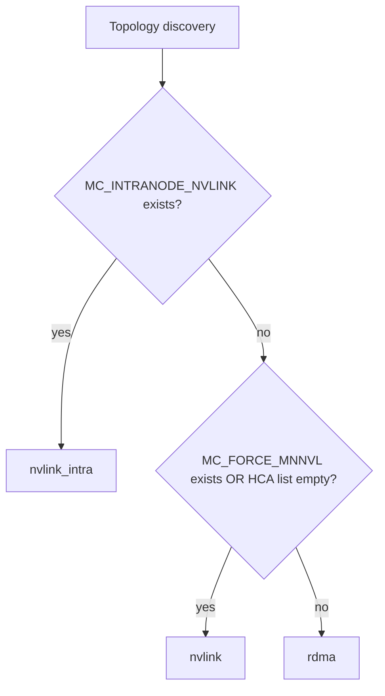

# Mooncake Transport Selection and Actual Runtime Data Paths

기준: Mooncake Transfer Engine `0.3.10.post2`

이 문서는 `rdma`, `nvlink`, `nvlink_intra`, `tcp`라는 설정 이름이 **실제 memory registration과 data movement에서 무엇을 의미하는지**를 source code branch까지 내려가 정리한다.

---

## 1. 먼저 알아야 할 것: transport 선택은 2단계다

### 1단계 — engine initialization에서 transport object 설치

`TransferEngineImpl::init()`이 topology를 탐색하고 build macro/environment 조건에 따라 `MultiTransport::installTransport()`를 호출한다.

### 2단계 — request마다 target segment protocol로 선택

`MultiTransport::selectTransport()`:

```cpp
auto target_segment_desc = metadata_->getSegmentDescByID(entry.target_id);
auto proto = target_segment_desc->protocol;
...
transport = transport_map_[proto].get();
```

따라서 다음 세 조건이 모두 중요하다.

```text
A. binary에 transport 구현이 compile되어 있는가?
B. initialization에서 그 transport가 install되었는가?
C. remote target segment가 어떤 protocol을 advertise하는가?
```

---

## 2. `mooncake_protocol`의 정확한 의미

vLLM v0.27.1은:

```python
protocol = kv_connector_extra_config.get("mooncake_protocol", "rdma")
engine.initialize(hostname, "P2PHANDSHAKE", protocol, device_name)
```

를 수행한다.

하지만 **vLLM log에 `using rdma as its protocol`이 출력됐다고 실제 request가 RDMA transport로 이동했다는 증명은 아니다.**

Mooncake Python binding/allocator 초기화와 C++ Transfer Engine auto-discovery, remote segment protocol까지 함께 봐야 한다.

---

# Part A. Runtime selection branch

## 3. NVLink implementation이 compiled된 image

`transfer_engine_impl.cpp`에서:

```cpp
#elif defined(USE_MNNVL) || defined(USE_INTRA_NVLINK)

const char* force_mnnvl = getenv("MC_FORCE_MNNVL");
const char* intra_env = getenv("MC_INTRANODE_NVLINK");

if (intra_env) {
    installTransport("nvlink_intra")
} else if (force_mnnvl || HCA_list.empty()) {
    installTransport("nvlink")
} else {
    installTransport("rdma")
}
```

즉:



### 환경변수의 함정

`getenv()` 결과의 존재 여부를 검사한다.

따라서:

```bash
MC_INTRANODE_NVLINK=0
```

도 **활성**이다.

비활성화하려면 env key 자체를 제거한다.

---

## 4. NVLink implementation이 compiled되지 않은 image

다른 compile branch에서는:

```text
HCA 발견 && MC_FORCE_TCP 없음
 OR MC_FORCE_HCA 존재
   -> rdma
else
   -> tcp
```

이 branch에서 TCP가 fallback이다.

반면 `USE_MNNVL`/`USE_INTRA_NVLINK` branch에서는 TCP 구현을 같이 compile해도 **위 auto-selection의 fallback으로 TCP가 등장하지 않는다.**

따라서:

```text
USE_TCP=ON
```

은 "TCP class가 binary에 들어간다"는 뜻이지 "RDMA/NVLink 실패 시 TCP 자동 fallback"을 보장하지 않는다.

---

# Part B. `nvlink_intra`

## 5. 사용 목적

**같은 Linux host/node 안의 서로 다른 GPU process** 사이에서 CUDA IPC + P2P copy를 사용한다.

Network B의 node-local P/D Cell에서 가장 직접적인 Mooncake 경로다.

---

## 6. Local memory registration source path

`IntraNodeNvlinkTransport::registerLocalMemory()`:

1. `cudaPointerGetAttributes()`
2. device memory인지 확인
3. `cuMemGetAddressRange()`로 **실제 cudaMalloc allocation base/size** 확인
4. 이미 같은 allocation base가 등록되어 있으면 skip
5. `cudaIpcGetMemHandle(base_ptr)`
6. IPC handle을 serialize하여 segment buffer metadata에 저장

핵심 source comment:

> PyTorch 같은 caching allocator는 더 큰 cudaMalloc segment에서 tensor를 sub-allocate하므로, tensor pointer 자체가 아니라 allocation base granularity로 register해야 IPC relocation이 정확하다.

### 왜 이게 중요하나

예:

```text
cudaMalloc allocation base = 0x10000000
size = 1 GiB

PyTorch KV tensor view = 0x18000000
```

remote process가 IPC handle을 열면 같은 virtual address가 보장되지 않는다.

따라서:

```text
remote mapped base + (original tensor ptr - original allocation base)
```

로 relocation해야 한다.

---

## 7. Remote mapping

`relocateSharedMemoryAddress()`:

```text
remote BufferDesc
 -> serialized cudaIpcMemHandle
 -> cudaIpcOpenMemHandle(..., cudaIpcMemLazyEnablePeerAccess)
 -> remote allocation을 local VA에 map
 -> original offset만큼 주소 보정
```

mapping은 cache되어 이후 transfer마다 IPC open을 반복하지 않는다.

---

## 8. Actual copy

`submitTransfer()` / `submitTransferTask()`은 최종적으로:

```cpp
cudaMemcpy(..., cudaMemcpyDefault)
```

을 수행한다.

WRITE인 경우 개념적으로:

```text
P local GPU address
  -> CUDA peer mapping of D GPU allocation
  -> cudaMemcpyDefault
  -> D GPU allocation
```

### 중요한 표현상의 주의

class 이름은 `nvlink_intra`지만 `cudaMemcpyDefault`가 **물리 link를 직접 고정하는 API는 아니다.**

실제 device topology가:

- NVLink/NVSwitch peer path인지
- PCIe P2P인지

는 hardware topology에 따라 달라진다.

따라서 "nvlink_intra 초기화 성공"과 "NVLink traffic 발생"을 분리해서 검증한다.

---

## 9. `nvlink_intra` 검증

### 기능

```bash
nvidia-smi topo -m
```

- P GPU와 D GPU 사이 topology 확인
- P2P 가능 여부 확인

Mooncake log:

```text
Using Intra-Node NVLink transport (MC_INTRANODE_NVLINK set)
```

vLLM:

```text
actual P _send_blocks()
transfer return code 0
D finished_recving request
```

### 성능/physical proof

가능하면:

- DCGM/NVML NVLink TX/RX counters
- Nsight Systems CUDA memcpy activity
- PCIe/NVLink counter 비교
- node-local baseline memcpy benchmark

를 같이 본다.

---

# Part C. `nvlink` — MNNVL/Fabric Memory

## 10. `nvlink`와 `nvlink_intra`는 같은 기능이 아니다

Mooncake source에서 별도 class다.

```text
USE_MNNVL
  -> NvlinkTransport
  -> protocol="nvlink"

USE_INTRA_NVLINK
  -> IntraNodeNvlinkTransport
  -> protocol="nvlink_intra"
```

`nvlink`는 MNNVL/Fabric Memory를 염두에 둔 경로다.

단일 DGX/HGX node의 NVSwitch를 곧바로 "MNNVL cross-node"로 부르면 안 된다.

---

## 11. Fabric Memory capability check

`NvlinkTransport` constructor:

```text
supportFabricMem()
```

이 true면 Fabric Memory path를 사용한다.

source 조건:

- `MC_USE_NVLINK_IPC`가 존재하면 Fabric Memory 사용하지 않음
- visible CUDA device가 `CU_DEVICE_ATTRIBUTE_HANDLE_TYPE_FABRIC_SUPPORTED`를 지원해야 함

---

## 12. Fabric Memory registration

Fabric mode에서는:

```text
cuMemRetainAllocationHandle
cuMemGetAddressRange
cuMemExportToShareableHandle(... CU_MEM_HANDLE_TYPE_FABRIC ...)
```

으로 `CUmemFabricHandle`을 export해 metadata에 저장한다.

remote는 이 handle을 import/map한 뒤 address relocation을 수행한다.

실제 copy는 역시 최종적으로 `cudaMemcpyDefault`를 사용한다.

개념:

```text
P Fabric-allocated GPU memory
 -> CUmemFabricHandle export
 -> metadata
 -> D-side process imports remote fabric allocation
 -> virtual address map
 -> cudaMemcpyDefault
 -> MNNVL/NVLink fabric
```

---

## 13. IPC fallback in `NvlinkTransport`

Fabric Memory를 사용하지 않을 경우 같은 `NvlinkTransport` 내부에 CUDA IPC path가 있다.

```text
cudaIpcGetMemHandle
 -> remote cudaIpcOpenMemHandle
 -> cudaMemcpyDefault
```

따라서 runtime log에서 단순히 protocol=`nvlink`만 보고 Fabric Memory를 썼다고 단정하면 안 된다.

확인할 것:

```text
use_fabric_mem_
MC_USE_NVLINK_IPC
CUDA Fabric Handle support
allocation type
```

---

## 14. MNNVL 사용 판단

MNNVL을 실제 cross-node path로 사용하려면 최소한:

- 해당 GPU/platform의 Fabric Memory support
- MNNVL fabric 구성
- CUDA driver/runtime support
- exported/imported Fabric Memory handle 성공
- node boundary를 넘는 실제 traffic

을 증명해야 한다.

**H200 한 node에 NVSwitch가 있다는 사실만으로 cross-node MNNVL이 되는 것은 아니다.**

---

# Part D. RDMA

## 15. 목적

HCA를 통해 remote memory에 직접 접근한다.

Network A의 cross-node P/D 주요 후보다.

```text
P GPU VRAM
   |
   | memory registration
   v
RDMA MR / key
   |
   v
HCA
   |
IB / RoCE
   |
   v
remote HCA
   |
   v
D GPU VRAM
```

GPU memory가 GPUDirect RDMA 가능하게 등록되면 CPU host staging을 피할 수 있다.

---

## 16. Initialization과 topology

Mooncake topology discovery가 HCA list를 만든다.

`device_name` filter가 vLLM에서 Transfer Engine으로 전달되므로 **filter를 잘못 주어 HCA list가 비는 것도 transport selection을 바꿀 수 있다.**

PR #5처럼 NVLink compile branch에서는 HCA list가 비면 `nvlink`로 갈 수 있다.

즉:

```text
"rdma를 요청했는데 HCA filter가 틀림"
 -> 자동으로 nvlink branch
```

같은 의외의 결과가 가능하다.

---

## 17. RDMA 실제 성공 조건

최소 확인:

- `/dev/infiniband/*`
- verbs device discovery
- HCA port state
- IB/RoCE addressing/GID
- `memlock`
- GPU Direct 지원 driver/module
- GPU와 HCA NUMA/topology
- container에 필요한 device/resource 노출

### `nvidia-peermem` / DMA-BUF

GPU Direct RDMA 등록 방식은 CUDA/driver/OFED/UCX/verbs 조합에 따라 달라질 수 있다.

문서에서는 특정 한 module만 무조건 요구한다고 일반화하지 않고 **실환경에서 GPU memory MR이 host staging 없이 성공하는지**를 최종 기준으로 한다.

---

## 18. RDMA 검증

Mooncake transport log 외에도:

- `ibv_devinfo`
- `ibstat`
- HCA port counters
- `perfquery`/vendor telemetry
- GPU/NIC topology
- transfer throughput

을 본다.

핵심은:

```text
RDMA transport initialized
```

가 아니라:

```text
GPU memory registered
 + actual P->D transfer
 + NIC byte counters 증가
 + D local recompute 없음
```

이다.

---

# Part E. TCP

## 19. TCP의 위치

TCP는 기능적으로 유용한 fallback/debug path지만 GPU P/D production의 목표 path는 아니다.

Mooncake TCP transport는 GPU memory transfer에서 host staging을 사용한다.

개념:

```text
GPU source
 -> GPU-to-host copy
 -> host staging buffer
 -> TCP socket
 -> remote host staging
 -> host-to-GPU copy
 -> GPU destination
```

따라서:

- CPU copy
- PCIe traffic
- socket stack

비용이 추가된다.

---

## 20. TCP가 useful한 경우

- network reachability/control correctness 분리 테스트
- RDMA device가 없는 개발 환경
- transport-independent vLLM orchestration 확인

그러나 TCP가 성공했다고 GPU-direct path가 검증된 것은 아니다.

---

# Part F. 상황별 build/runtime matrix

## 21. Network B node-local

권장 실험:

```text
Build:
  USE_CUDA=ON
  USE_INTRA_NVLINK=ON

Runtime:
  MC_INTRANODE_NVLINK=1
  mooncake_protocol=nvlink_intra
```

확인:

```text
same-node placement
P2P capability
actual P WRITE
NVLink/NVSwitch counters if available
```

---

## 22. MNNVL-capable fabric

```text
Build:
  USE_CUDA=ON
  USE_MNNVL=ON

Runtime:
  MC_FORCE_MNNVL=1
  mooncake_protocol=nvlink
```

추가 확인:

- Fabric Memory support
- `MC_USE_NVLINK_IPC` 부재 여부
- exported Fabric Handle path
- actual cross-node fabric topology

---

## 23. Network A RDMA

재현성이 중요하면 NVLink branch와 섞지 않은 **RDMA-focused image**도 고려한다.

```text
Build:
  USE_CUDA=ON
  USE_MNNVL=OFF
  USE_INTRA_NVLINK=OFF
  USE_TCP=ON
  verbs/RDMA dependencies

Runtime:
  HCA visible
  MC_FORCE_TCP absent
```

이 profile에서는 HCA가 없을 때 TCP fallback semantics가 명확하다.

---

# Part G. Source-level failure tree

## 24. `Unsupported transport`

`MultiTransport::installTransport()`에서 object가 만들어지지 않음.

원인:

```text
requested protocol
 -> corresponding compile macro absent
```

대응:

- wheel source/build manifest 확인
- CMakeCache 확인
- `.so` symbols/string만 보는 것보다 source lock + feature flags를 보존

---

## 25. `device memory not registered`

remote target address가 advertised registered region 범위에 없거나 remote mapping 실패.

확인:

- tensor/storage address
- allocation base
- block pointer arithmetic
- remote metadata stale 여부
- engine restart 여부

---

## 26. CUDA IPC open 실패

가능 원인:

- 다른 host
- incompatible process/device visibility
- allocation lifetime 종료
- stale handle
- container/device isolation

`nvlink_intra`는 same-host IPC라는 전제가 깨지면 안 된다.

---

## 27. transfer return code != 0

vLLM `_send_blocks()`에서:

```python
ret_value = self.engine.batch_transfer_sync_write(...)
```

return value가 0이 아니면 Mooncake transfer failure다.

이 시점은 router/control plane보다 아래다.

---

# Part H. 실제 data path를 증명하는 체크리스트

```text
[ ] connector init 성공
[ ] intended transport가 binary에 compiled
[ ] intended transport가 initialization에서 installed
[ ] remote segment protocol이 intended transport
[ ] P/D KV memory registration 성공
[ ] src/dst pointers/descriptor count 생성
[ ] actual batch_transfer_sync_write 호출
[ ] transfer return=0
[ ] D receive completion
[ ] D prompt recompute 없음
[ ] hardware counter가 기대 physical fabric과 일치
```

이 체크를 통과해야만 "Mooncake로 KV transfer 성공"이라고 기록한다.

---

## References

- `transfer_engine_impl.cpp`: https://github.com/kvcache-ai/Mooncake/blob/v0.3.10.post2/mooncake-transfer-engine/src/transfer_engine_impl.cpp
- `multi_transport.cpp`: https://github.com/kvcache-ai/Mooncake/blob/v0.3.10.post2/mooncake-transfer-engine/src/multi_transport.cpp
- `intranode_nvlink_transport.cpp`: https://github.com/kvcache-ai/Mooncake/blob/v0.3.10.post2/mooncake-transfer-engine/src/transport/intranode_nvlink_transport/intranode_nvlink_transport.cpp
- `nvlink_transport.cpp`: https://github.com/kvcache-ai/Mooncake/blob/v0.3.10.post2/mooncake-transfer-engine/src/transport/nvlink_transport/nvlink_transport.cpp
