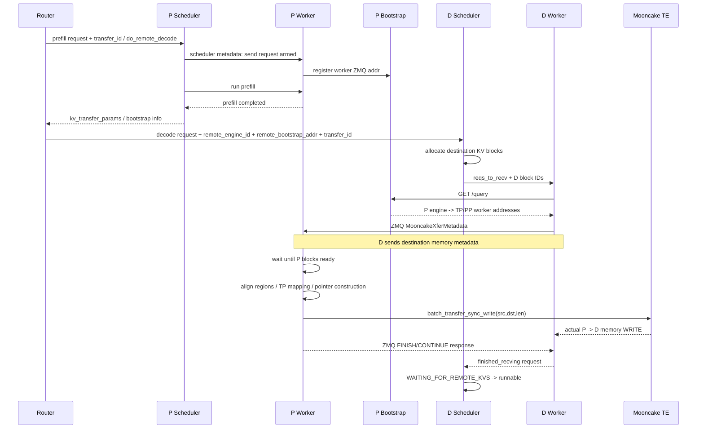

# MooncakeConnector ↔ Transfer Engine End-to-End Flow and Debugging

기준: vLLM `v0.27.1`, Mooncake Transfer Engine `0.3.10.post2`

이 문서는 장애 시 **Router → vLLM Scheduler → Worker side channel → Mooncake Transfer Engine → physical transport**를 순서대로 추적하기 위한 runbook 겸 source guide다.

---

# 1. End-to-end sequence



---

# 2. Router contract

Mooncake vLLM path는 router가 P/D handoff identity를 만들어야 한다.

Decode remote-prefill path가 요구하는 핵심 값:

```text
remote_engine_id
remote_bootstrap_addr
transfer_id
do_remote_prefill = true
```

Prefill 쪽은:

```text
transfer_id
do_remote_decode = true
```

를 기반으로 send state를 만든다.

## 가장 중요한 invariant

P와 D가 **같은 logical handoff의 동일 `transfer_id`**를 가져야 한다.

다음은 failure candidate다.

```text
P request transfer_id=A
D request transfer_id=B
```

이 경우 bootstrap/network가 정상이어도 P side send metadata와 D request가 match되지 않는다.

---

# 3. Scheduler: Decode remote load

`MooncakeConnectorScheduler.get_num_new_matched_tokens()`:

```text
if do_remote_prefill:
  -> remote에서 가져올 prompt token count 계산
  -> (count, True)
```

`True`는 async load를 뜻한다.

Scheduler는 destination slots를 먼저 할당한 뒤:

```python
update_state_after_alloc(...)
```

을 호출한다.

조건:

```text
remote_engine_id
remote_bootstrap_addr
transfer_id
```

가 모두 있으면 `_reqs_need_recv`에 request를 넣는다.

### 디버그 포인트

이 단계에서:

```text
num_external_tokens > 0
load_kv_async = true
request -> WAITING_FOR_REMOTE_KVS
```

가 되어야 한다.

그렇지 않으면 아직 Mooncake Transfer Engine까지 내려간 문제가 아니다.

---

# 4. Scheduler: Prefill send lifetime

P request는 `do_remote_decode`와 `transfer_id`를 보고 send tracking을 시작한다.

Prefill request가 끝났을 때 `request_finished()`는 P blocks를 즉시 free할지 판단한다.

실제 전송해야 할 block이 있으면:

```text
delay_free_blocks = true
```

가 되어 P KV block lifetime을 transfer completion까지 연장한다.

### 왜 중요한가

P가 block을 먼저 free하면:

```text
P block address
 -> allocator reuse
 -> D가 stale address의 다른 request data를 받음
```

같은 correctness failure가 될 수 있다.

---

# 5. Worker bootstrap

P producer worker는 `register_kv_caches()` 이후 ZMQ sender listener를 띄운다.

각 worker는:

```text
engine_id
dp_rank
tp_rank
pp_rank
worker ZMQ addr
```

를 `MooncakeBootstrapServer /register`에 등록한다.

D는 `remote_bootstrap_addr + /query`를 조회해:

```text
remote_engine_id
 -> TP rank
   -> PP rank
     -> worker_addr
```

map을 얻는다.

---

# 6. Bootstrap 장애

## 증상

```text
Failed to connect to bootstrap server
Failed to find remote engine_id
```

## 확인 순서

1. `remote_bootstrap_addr`가 실제 P instance 주소인지
2. Service/Pod network route
3. bootstrap port exposure
4. P engine이 restart되어 `engine_id`가 바뀌지 않았는지
5. DP topology 때문에 다른 bootstrap server를 보고 있지 않은지
6. TP0/PP0 worker가 bootstrap server를 실제 launch했는지

### stale `engine_id`

router가 이전 P instance의 `engine_id`를 cache하고 P가 restart된 경우 흔한 failure다.

```text
old P engine_id
 -> P restart
 -> new engine_id
 -> router still hands old ID to D
```

이 경우 "network 연결 불가"처럼 보일 수 있지만 실제로는 **logical peer identity stale**다.

---

# 7. D → P ZMQ transfer request

D worker는 `MooncakeXferMetadata`를 만든다.

포함 정보:

```text
D hostname
D Mooncake Transfer Engine RPC port
D TP size/rank
request_id -> transfer_id + D local block IDs
D KV cache base addresses
block lengths
KV block lengths
registered layer names/indices/group indices
```

중요:

**D는 여기서 KV bytes를 받는 destination memory geometry를 P에 알려준다.**

---

# 8. P side rank pairing

P는:

```python
self.transfer_topo.handshake_target_ranks(meta.remote_tp_size)
```

를 사용해 이 P TP rank가 어느 D TP rank와 pair되는지 확인한다.

D의 `remote_tp_rank`가 expected list에 없으면 error response를 보낸다.

### heterogeneous TP

예:

```text
P TP=2
D TP=4
```

한 P rank가 여러 D rank로 split transfer할 수 있다.

반대로 P TP가 더 크면 D rank가 여러 P에서 받아야 한다.

따라서 "TP rank 번호가 같아야 한다"는 단순 가정은 틀리다.

---

# 9. Region alignment

P/D가 등록한 KV region을 position만으로 zip하면 PP/HMA에서 잘못 매칭될 수 있다.

v0.27.1은:

```text
(layer_name, occurrence)
```

을 key로 region을 align하고:

- `layer_index`
- `group_index`

도 검사한다.

### error examples

```text
producer registered layer has no matching consumer occurrence
registered layer index mismatch
registered group index mismatch
```

이 error는 transport 문제가 아니라 **KV cache layout/config compatibility 문제**다.

---

# 10. Asymmetric TP region length validation

Mooncake는 P/D TP ratio와 KV replication 여부를 바탕으로 source/destination `kv_block_len` 관계를 검사한다.

예:

```text
homogeneous TP
 -> local kv_block_len == remote kv_block_len

heterogeneous TP split
 -> one side region length = other side * TP ratio
```

MLA처럼 cache가 replicated되는 경우 별도 처리한다.

이 검사가 실패하면 **잘못된 byte slice transfer를 시작하기 전에 fail**한다.

---

# 11. P block ready synchronization

D request가 P에 먼저 도착할 수 있다.

P `send_kv_to_decode()`는 `SendBlockMeta.ready`를 기다린다.

P Scheduler가 request finish/block IDs를 worker에 넘기면:

```text
send_meta.local_block_ids = block_ids
send_meta.ready.set()
```

된다.

### timeout

`VLLM_MOONCAKE_ABORT_REQUEST_TIMEOUT` 동안 ready되지 않으면 transfer를 포기하고 D에 error request를 반환한다.

가능 원인:

- router의 P/D request lifecycle mismatch
- P request abort
- transfer_id mismatch
- P scheduling/worker metadata 전달 실패
- long stall

---

# 12. Block list normalization

v0.27.1은 hybrid cache group identity를 보존한다.

```text
local_block_ids_by_group
remote_block_ids_by_group
```

각 group을 별도로 다룬다.

Mamba/GDN group에서는 `NULL_BLOCK_ID` placeholder를 transfer 대상에서 제거한다.

remote D가 local prefix hit를 이미 가진 경우 remote block count가 더 적을 수 있으며, P는 필요한 suffix만 맞춘다.

---

# 13. Logical block vs kernel physical block

Speculative decoding/attention backend에 따라 logical block size와 kernel physical block size가 다를 수 있다.

예:

```text
logical block 544 tokens
kernel block 32 tokens
 -> one logical attention block => 17 physical blocks
```

Mooncake는 attention group block IDs를 physical kernel blocks로 expand한다.

Mamba/GDN state block은 token page와 semantics가 달라 동일 방식으로 expand하지 않는다.

이 영역에서 block-size mismatch를 무시하면 pointer arithmetic이 틀어진다.

---

# 14. Transfer descriptor construction

각 aligned KV region에 대해:

```text
local block IDs
remote block IDs
TP transfer plan
```

을 조합한다.

`_get_sender_transfer_plan()`이:

```text
should_transfer
src_region_offset
dst_region_offset
transfer_len
```

을 반환한다.

그 뒤 pointer:

```text
src = local_base + local_block * local_stride + src_offset
dst = remote_base + remote_block * remote_stride + dst_offset
```

를 만든다.

---

# 15. Descriptor coalescing

source와 destination block IDs가 동시에 연속이면 여러 작은 copy를 하나의 큰 descriptor로 합칠 수 있다.

```text
src blocks: 10,11,12,13
D blocks:   40,41,42,43
```

이고 layout/stride가 compatible하면:

```text
4 descriptors
 -> 1 descriptor, length = block_transfer_len * 4
```

로 줄인다.

이는 control/submit overhead와 transfer efficiency에 직접 영향을 준다.

---

# 16. 실제 transfer call

vLLM 마지막 경계:

```python
self.engine.batch_transfer_sync_write(
    remote_session,
    src_ptrs,
    dst_ptrs,
    lengths,
)
```

여기서부터는 Mooncake Transfer Engine 영역이다.

`remote_session`:

```text
D_hostname:D_TransferEngine_rpc_port
```

이다.

---

# 17. Transfer success metric 위치

Mooncake v0.27.1 connector의 성공 transfer latency/bytes/descriptor count는 **P worker**가 기록한다.

이유:

```text
P가 batch_transfer_sync_write()를 호출하는 주체
```

D worker는 successful data op handle을 직접 소유하지 않고 ZMQ response를 통해 completion을 안다.

따라서 NIXL dashboard처럼 D에서 successful xfer stats를 찾으면 "metric이 없다"고 오판할 수 있다.

---

# 18. D completion

P가 transfer 후 ZMQ response를 보낸다.

status:

```text
CONTINUE
FINISH
ERROR
```

D는 request별 `pull_tasks_count`를 감소시키고 0이 되면:

```text
finished_recving_reqs.add(d_req_id)
```

한다.

TP/PP topology 때문에 한 D request가 여러 P worker response를 기다릴 수 있다.

---

# 19. Full prefix cache hit 특수 case

D local prefix cache에서 이미 전부 hit하면 실제 remote blocks가 0일 수 있다.

그렇더라도 P가 hold한 transfer state/block lifetime을 정리하기 위한 control notification이 필요할 수 있다.

"0 bytes transfer"가 무조건 connector 미동작을 뜻하지 않는다.

request token/cache state를 같이 봐야 한다.

---

# 20. 장애 taxonomy

## Layer 0: Routing

```text
wrong P endpoint
wrong transfer_id
missing remote_bootstrap_addr
stale engine_id
```

## Layer 1: Scheduler

```text
remote token count=0 unexpectedly
D destination block allocation failure
request not entering WAITING_FOR_REMOTE_KVS
```

## Layer 2: vLLM side channel

```text
bootstrap registration/query failure
ZMQ connection/timeout
P ready timeout
```

## Layer 3: KV layout

```text
layer/region mismatch
TP mapping mismatch
block size mismatch
HMA group mismatch
PP ownership mismatch
```

## Layer 4: Mooncake runtime

```text
unsupported transport
memory registration failure
remote segment missing
transport return != 0
```

## Layer 5: hardware

```text
CUDA IPC/P2P impossible
HCA unavailable
GDR registration failure
fabric unsupported
network path failure
```

---

# 21. 로그를 보는 추천 순서

```text
1. Router request/response
2. D Scheduler: external token count + WAITING_FOR_REMOTE_KVS
3. P/D connector init: engine_id / role
4. Mooncake transport initialization
5. KV cache registration
6. P bootstrap registrations
7. D bootstrap query
8. D ZMQ transfer request
9. P ready
10. descriptor count / total bytes
11. batch_transfer_sync_write duration / return
12. D finished receive
13. decode starts without prompt recompute
```

---

# 22. `device_name` 함정

vLLM extra config의 `device_name`은 Mooncake topology/HCA filter에 영향을 준다.

잘못된 filter로 HCA가 0개가 되면 NVLink-enabled build에서 auto-selection이 `nvlink`로 바뀔 수 있다.

따라서 "RDMA가 왜 안 떴지?" 상황에서:

```text
actual HCA visibility
 + device_name filter
 + HCA discovery log
```

를 같이 본다.

---

# 23. 장애 시 recompute가 문제를 숨기는지 확인

초기 certification에서는 connector failure가 local recompute로 조용히 회복되면 "P/D 성공"처럼 보일 수 있다.

가능하면:

```json
"kv_load_failure_policy":"fail"
```

을 사용해 remote load failure를 fail-fast한다.

그리고 D metrics/log에서 prompt compute token이 다시 실행되지 않았는지 확인한다.

---

# 24. Kubernetes P/D Cell에서의 운영 체크

Network B node-local cell:

```text
Pod
├── pd-router
├── p-engine(s)
└── d-engine(s)
```

이라면 다음이 중요하다.

- P/D containers가 실제 동일 node인지
- CUDA device visibility/rank mapping
- P/D container network namespace 관계
- bootstrap/ZMQ port collision
- side channel readiness
- container restart 시 engine_id/router state 갱신
- 한 engine crash 후 stale bootstrap entry 제거

Pod 단위 restart policy를 쓰는 이유 중 하나가 **이러한 peer identity와 registered GPU memory lifetime을 cell 단위로 다시 일치시키기 쉽기 때문**이다.

---

# 25. Production certification checklist

## Control plane

```text
[ ] P/D transfer_id 동일
[ ] D가 정확한 P engine_id 사용
[ ] P bootstrap address reachable
[ ] TP/PP worker address map 정상
[ ] no port collision
```

## Memory/layout

```text
[ ] P/D model revision 동일
[ ] dtype/KV dtype compatible
[ ] attention backend/layout compatible
[ ] logical/physical block mapping 정상
[ ] registered region/group count 정상
[ ] heterogeneous TP mapping 검증
```

## Data plane

```text
[ ] intended Mooncake transport installed
[ ] memory registration 성공
[ ] actual `_send_blocks()` called
[ ] descriptor bytes > 0 for non-cache-hit request
[ ] return code 0
[ ] D receive completion
```

## Semantic proof

```text
[ ] D local prompt recompute 없음
[ ] output correctness baseline과 일치
[ ] abort/timeout에서 P blocks eventually released
```

## Performance proof

```text
[ ] transfer latency
[ ] bytes/transfer
[ ] descriptors/transfer
[ ] effective GB/s
[ ] TTFT split
[ ] GPU/NIC/NVLink physical counters
```

---

## References

- vLLM Mooncake connector: https://github.com/vllm-project/vllm/blob/v0.27.1/vllm/distributed/kv_transfer/kv_connector/v1/mooncake/mooncake_connector.py
- vLLM Scheduler: https://github.com/vllm-project/vllm/blob/v0.27.1/vllm/v1/core/sched/scheduler.py
- Mooncake runtime docs in this directory: [README](README.md), [transport paths](transport-and-runtime-paths.md)
