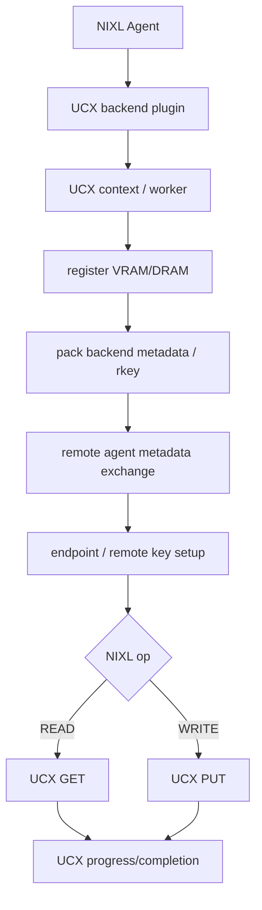

# NIXL Backend Plugins and Actual Data Paths

기준: NIXL `1.3.1` / vLLM `v0.27.1`

이 문서는 vLLM에서 기본적으로 중요한 **UCX backend**를 가장 깊게 보고, LIBFABRIC과 storage backend가 NIXL abstraction 안에서 어디에 위치하는지도 정리한다.

---

# 1. NIXL backend를 physical transport와 동일시하지 말 것

```text
NIXL backend = UCX
```

라고 설정했을 때 실제 경로는 다시 UCX 내부 선택으로 내려간다.

예:

```text
NIXL
 -> UCX backend
   -> UCX
      |-- cuda_ipc / cuda_copy
      |-- rc / dc over IB/RoCE
      |-- shared memory
      `-- tcp
```

따라서 NIXL backend 이름은 **한 단계 위 abstraction**이다.

---

# 2. vLLM backend selection

vLLM NIXL worker:

```python
backends = kv_connector_extra_config.get("backends", ["UCX"])
```

예:

```json
{
  "kv_connector_extra_config": {
    "backends": ["UCX"]
  }
}
```

또는:

```json
{
  "kv_connector_extra_config": {
    "backends": ["LIBFABRIC"]
  }
}
```

### 주의

`NIXL_BACKEND`, `VLLM_NIXL_BACKEND` 같은 임의 env를 vLLM connector의 transport override라고 생각하지 않는다.

vLLM 공식 usage guide는 `kv_connector_extra_config.backends`를 사용한다.

---

# Part A. UCX backend

## 3. NIXL source 위치

NIXL v1.3.1:

```text
src/plugins/ucx/
├── ucx_backend.cpp
├── ucx_backend.h
├── ucx_plugin.cpp
├── ucx_utils.cpp
├── mem_list.cpp
├── rkey.cpp
├── config.cpp
└── ...
```

NIXL plugin layer가 UCX context/worker/endpoint/memory registration/progress를 관리한다.

---

## 4. UCX backend high-level lifecycle



NIXL UCX source는 underlying UCP GET/PUT primitive를 사용한다.

즉 vLLM:

```text
make_prepped_xfer("READ")
```

는 NIXL/UCX에서 remote GET 계열로,

```text
make_prepped_xfer("WRITE")
```

는 remote PUT 계열로 내려간다고 이해하면 된다.

---

## 5. UCX memory registration

NIXL이 VRAM descriptor를 UCX backend에 등록하면 UCX는 CUDA memory type을 인지해 사용할 memory domain/transport를 준비한다.

cross-node GDR path라면 개념적으로:

```text
CUDA VRAM
 -> UCX memory mapping/registration
 -> UCT memory domain
 -> RDMA-capable NIC registration/key
 -> remote rkey metadata
```

same-node CUDA IPC path라면 peer process memory handle/IPC 지원이 사용될 수 있다.

NIXL의 metadata exchange에는 UCX backend가 remote access에 필요한 backend-specific information이 들어간다.

---

## 6. UCX READ path

vLLM Pull 기준:

```text
D local prepared descriptors
P remote prepared descriptors
        |
        v
NIXL READ
        |
        v
UCX backend
        |
        v
UCP GET
        |
        +-- same host: CUDA IPC/P2P capable lane
        `-- remote host: RDMA-capable UCX lane or other selected lane
        |
        v
D local KV VRAM
```

D가 initiator다.

---

## 7. UCX WRITE path

vLLM Push 기준:

```text
P local descriptors
D remote descriptors
       |
       v
NIXL WRITE
       |
       v
UCX backend
       |
       v
UCP PUT
       |
       v
D KV VRAM
```

P가 initiator다.

---

## 8. UCX progress

UCX request는 비동기다.

NIXL UCX backend에는:

- request handle tracking
- UCX worker progress loop
- optional progress thread/threadpool
- connection state check

가 있다.

vLLM의 async NIXL transfer가 실제로 asynchronous일 수 있는 기반이 이 계층이다.

### 성능 의미

data wire time만 빠르더라도:

- request setup
- descriptor count
- progress scheduling
- Python/C++ boundary
- completion polling

이 크면 P/D handoff TTFT가 높아질 수 있다.

---

# Part B. UCX가 실제 physical path를 결정하는 법

## 9. `UCX_TLS`

UCX가 사용할 transport set을 제한/선택한다.

예를 들어 개념적으로:

```bash
UCX_TLS=rc,cuda_copy,cuda_ipc
```

처럼 구성할 수 있다.

정확한 transport 이름/조합은 설치된 UCX와 환경에서 `ucx_info -d`로 확인한다.

### `all`의 의미

```bash
UCX_TLS=all
```

은 편리하지만 certification에서는 **어떤 lane을 실제 선택했는지 불명확**할 수 있다.

성능/경로 인증 단계에서는 허용 transport를 좁힌 A/B 테스트가 유용하다.

---

## 10. `UCX_NET_DEVICES`

cross-node network device를 선택한다.

예:

```bash
UCX_NET_DEVICES=mlx5_0:1
```

P/D multi-NIC 환경에서는 GPU/NIC affinity까지 고려해야 한다.

`NCCL_IB_HCA`는 NIXL UCX path를 설정하는 knob가 아니다.

---

## 11. Same-node NVIDIA path

가능한 logical path:

```text
P VRAM
 -> NIXL UCX descriptor
 -> UCX same-host endpoint
 -> CUDA IPC mapping / CUDA-aware copy lane
 -> P2P copy
 -> D VRAM
```

### physical fabric

CUDA P2P 자체가:

- NVLink/NVSwitch
- PCIe P2P

중 무엇을 쓰는지는 GPU topology가 결정한다.

따라서:

```text
NIXL=UCX
 + cuda_ipc enabled
```

만으로 "NVLink 사용"이라고 기록하지 않는다.

---

## 12. Network A cross-node RDMA path

목표:

```text
P VRAM
 -> NIXL UCX registration
 -> UCX GPUDirect-capable memory domain
 -> HCA
 -> InfiniBand/RoCE
 -> remote HCA
 -> D VRAM
```

검증:

- UCX log에서 selected devices/lane
- HCA counters
- GPU/NIC topology
- effective bandwidth
- CPU staging 여부

---

## 13. TCP fallback 가능성

UCX가 설치돼 있다고 해서 항상 RDMA를 사용하지 않는다.

환경/`UCX_TLS`/device discovery에 따라 TCP lane이 선택될 수 있다.

따라서 network이 느린데 NIXL transfer 자체는 성공한다면:

```text
UCX backend 성공
!=
RDMA 성공
```

을 먼저 의심한다.

---

# Part C. LIBFABRIC backend

## 14. 위치

NIXL v1.3.1:

```text
src/plugins/libfabric/
```

NIXL은 libfabric을 통해 provider abstraction을 사용할 수 있다.

underlying libfabric path는 read/write primitive를 provider에 제출한다.

---

## 15. 왜 별도 backend인가

UCX와 libfabric은 둘 다 HPC/network abstraction이지만 endpoint/provider/registration/progress model이 다르다.

NIXL이 상위에서 동일 descriptor/READ/WRITE abstraction을 제공하므로 framework는 backend 교체 시 P/D logic을 다시 쓰지 않아도 된다.

---

## 16. AWS EFA 같은 환경

vLLM 공식 NIXL 문서는 LIBFABRIC backend 예를 제공한다.

예:

```json
{
  "kv_connector_extra_config": {
    "backends": ["LIBFABRIC"]
  }
}
```

provider 선택은 libfabric 환경 설정으로 내려간다.

즉:

```text
vLLM
 -> NIXL backend LIBFABRIC
 -> libfabric
 -> provider (예: EFA)
```

계층이다.

우리 Network A가 IB 중심이면 UCX를 먼저 baseline으로 삼고, 특정 fabric/provider 요구가 있을 때 LIBFABRIC을 별도 평가한다.

---

# Part D. GDS / storage plugins

## 17. NIXL은 network-only library가 아니다

NIXL의 강점 중 하나가 memory와 storage를 같은 transfer abstraction으로 가져가려는 것이다.

source tree에:

- CUDA GDS
- multi-thread GDS
- POSIX
- object storage
- HF3FS
- Azure Blob

등이 존재한다.

P/D direct handoff에서는 주로 UCX/LIBFABRIC이 관심 대상이지만, 장기적으로 remote KV tier/offloading을 설계하면 같은 NIXL architecture가 storage data path까지 확장될 수 있다.

---

## 18. GDS의 conceptual path

```text
GPU VRAM
 <-> GPUDirect Storage / cuFile
 <-> NVMe / filesystem
```

이는 P→D direct memory transfer와 목적이 다르다.

`NixlConnector` P/D와 storage-backed KV cache를 하나로 혼동하지 않는다.

---

# Part E. NIXL Mooncake plugin

## 19. 매우 중요한 이름 충돌

NIXL v1.3.1 source tree에는:

```text
src/plugins/mooncake/
```

가 있다.

하지만 이것은:

```text
vLLM NixlConnector
 -> NIXL
 -> Mooncake backend plugin
```

경로다.

우리가 현재 사용하는:

```text
vLLM MooncakeConnector
 -> Mooncake Transfer Engine directly
```

와 다르다.

### 왜 기록해야 하나

향후 로그나 dependency tree에서 `mooncake`라는 이름을 보고 어떤 integration인지 혼동하기 쉽다.

문서/배포 config에는 항상:

```text
vLLM connector = ?
NIXL backend = ?
```

를 별도로 기록한다.

---

# Part F. Backend selection algorithm 개념

## 20. NIXL core 입장

공식 architecture상 동일 memory가 여러 backend에 등록될 수 있다.

transaction을 만들 때:

- local descriptor memory type
- remote descriptor memory type
- 양쪽 agent가 공통으로 지원하는 backend
- capability

를 바탕으로 적절한 backend를 선택할 수 있다.

vLLM에서는 `backends`를 명시하여 후보 범위를 통제하는 편이 재현성에 유리하다.

---

# Part G. 어떤 backend를 먼저 볼 것인가

## 21. Network B — same-node

우선:

```text
NIXL + UCX
NixlPushConnector
```

와 Pull을 비교한다.

검증:

- CUDA direct buffer (`kv_buffer_device=cuda`)
- UCX CUDA support
- cuda_ipc path
- actual GPU P2P physical topology

---

## 22. Network A — IB/RDMA

우선:

```text
NIXL + UCX
```

검증 후 필요 시:

```text
NIXL + LIBFABRIC
```

을 비교한다.

---

# Part H. Source-level debugging map

## 23. vLLM → NIXL

```text
vllm/.../nixl/base_worker.py
 -> get_reg_descs
 -> register_memory
 -> get_xfer_descs
 -> prep_xfer_dlist
 -> make_prepped_xfer
 -> transfer
```

## 24. NIXL core → UCX

```text
NIXL Agent
 -> UCX plugin/backend
 -> UCX endpoint/rkey
 -> UCP GET or PUT
 -> progress/status
```

## 25. UCX → hardware

```text
UCX transport/lane selection
 -> CUDA IPC/P2P OR RDMA OR TCP/other
 -> physical GPU/NIC fabric
```

장애 분석은 이 세 경계를 하나씩 좁혀야 한다.

---

# Part I. 관측해야 할 metric

## 26. NIXL/vLLM

- successful transfer count
- failed transfer count
- xfer latency
- post/submission latency
- bytes per transfer
- descriptor count
- throughput
- handshake failure
- notification failure
- lease expiry

## 27. UCX

- selected transport/device log
- endpoint connection errors
- memory registration errors
- request completion/progress latency

## 28. hardware

- NVLink traffic
- PCIe traffic
- HCA TX/RX bytes
- RDMA counters
- CPU utilization/memory bandwidth

---

# Part J. 성능 해석

## 29. effective transfer time decomposition

```text
T_NIXL_handoff
 = descriptor index build
 + prepared xfer creation
 + backend request setup
 + endpoint/rkey setup if cold
 + actual data movement
 + progress/completion
 + notification
```

첫 request와 steady-state를 반드시 분리해서 측정한다.

첫 request에는 handshake/remote agent setup이 포함될 수 있다.

---

## 30. descriptor count가 중요한 이유

KV block size가 작으면 수천~수만 descriptor가 생길 수 있다.

wire bandwidth가 충분해도:

```text
Python list / NumPy index
 -> NIXL request construction
 -> UCX operation fan-out
```

비용이 커진다.

따라서 benchmark에는:

```text
block size
number of transferred blocks
number of descriptors
bytes
post latency
wire time
```

을 같이 기록한다.

---

## References

- vLLM NIXL usage: https://github.com/vllm-project/vllm/blob/v0.27.1/docs/features/nixl_connector_usage.md
- NIXL architecture: https://github.com/ai-dynamo/nixl/blob/v1.3.1/docs/nixl.md
- NIXL UCX plugin: https://github.com/ai-dynamo/nixl/tree/v1.3.1/src/plugins/ucx
- NIXL LIBFABRIC plugin: https://github.com/ai-dynamo/nixl/tree/v1.3.1/src/plugins/libfabric
