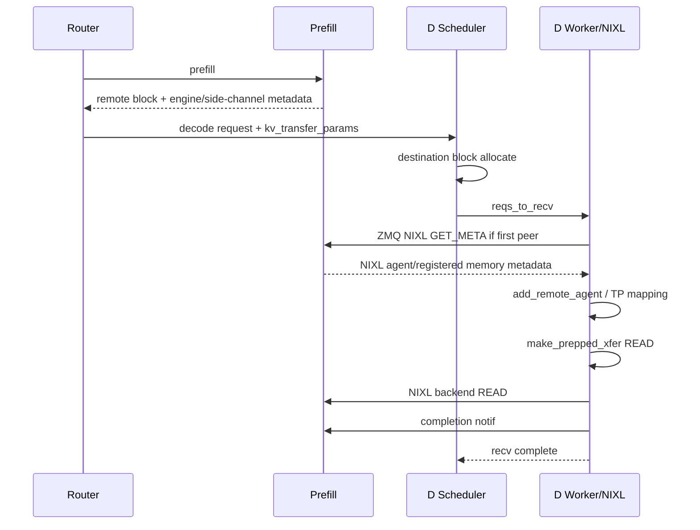
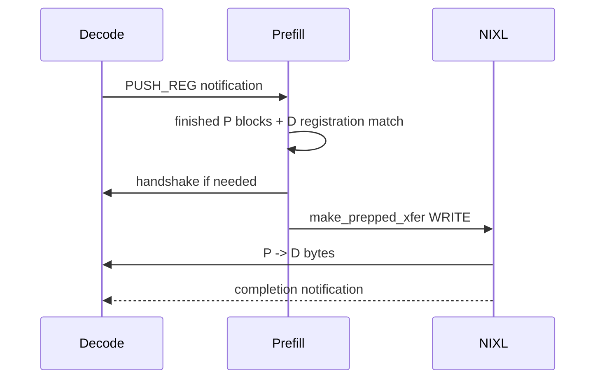

# vLLM v0.27.1 NIXL Integration — Pull, Push, Handshake, TP Mapping

기준: vLLM `v0.27.1`, NIXL `1.3.1`

이 문서는 NIXL core 위에서 vLLM이 **P/D KV block orchestration을 어떻게 구현하는지** source call chain으로 정리한다.

---

# 1. Connector class 구조

`connector.py`:

```text
NixlBaseConnector
├── NixlPullConnector
└── NixlPushConnector

NixlConnector = NixlPullConnector
```

즉 기존 설정:

```json
{"kv_connector":"NixlConnector"}
```

의 현재 의미는 **Pull-based READ connector**다.

---

# 2. Scheduler/Worker 분리

두 mode 모두:

```text
role=SCHEDULER
 -> Pull/Push Scheduler

role=WORKER
 -> Pull/Push Worker
```

로 분리된다.

Base class가 공통으로:

- HND layout request
- scheduler lifecycle forwarding
- memory registration forwarding
- stats/Prometheus
- handshake metadata

를 제공한다.

---

# 3. Startup — Worker NIXL agent

`NixlBaseConnectorWorker.__init__()`:

### backend config

```python
self.nixl_backends = extra_config.get("backends", ["UCX"])
```

기본은 UCX다.

### lease

```text
kv_lease_duration default 30s
```

### memory location

```text
kv_buffer_device=cuda
 -> direct device buffer

kv_buffer_device=cpu
 -> host transfer buffer
```

### NIXL agent

```text
NixlWrapper(unique UUID, agent config)
```

을 생성한다.

non-UCX backend가 있으면 backend list를 agent config에 명시하고 telemetry를 활성화하는 path가 있다.

UCX-only path에서는 `num_threads` 기본 4를 사용한다.

---

# 4. 왜 NIXL worker thread에서 CUDA device를 명시하나

NIXL handshake는 background thread에서 실행된다.

CUDA context는 thread-local 요소가 있기 때문에 device buffer 사용 시:

```python
current_platform.set_device(self.device_id)
```

를 handshake thread에서 명시한다.

source comment의 핵심:

> active CUDA context가 없으면 UCX가 CUDA IPC communication을 disable할 수 있고, 결과적으로 NVLink-capable same-node path도 사라질 수 있다.

따라서 same-node NIXL 문제에서 **worker main thread의 CUDA 설정만 확인해서는 부족하다.**

---

# 5. KV cache registration

vLLM GPUModelRunner 초기화 후:

```text
register_kv_caches(kv_caches)
```

가 호출된다.

Base worker는:

1. KV cache layout/HMA/model 특성 확인
2. layer별 base address와 physical page size 계산
3. memory type 결정 (`VRAM`/`DRAM`)
4. NIXL registered descriptor 생성
5. `register_memory(descs, backends=...)`
6. local transfer descriptor list 생성
7. prepared handle 생성
8. remote handshake용 `NixlAgentMetadata` 생성

한다.

---

# 6. Packed allocation 특수 path

DSv4 계열처럼 여러 layer tensor가 하나의 backing storage를 strided view로 공유할 수 있다.

v0.27.1 NIXL connector는:

```text
same storage pointer
+ different data_ptrs
```

를 감지하면 packed KV cache로 등록하는 path를 가진다.

이 경우 전체 backing storage를 하나의 NIXL region으로 보고 block stride를 계산한다.

이 기능은 **model-specific KV allocation layout 때문에 connector가 raw tensor list만 단순 register할 수 없다는 사례**다.

---

# 7. Handshake metadata 만들기

registration이 끝나면:

```text
NixlAgentMetadata
```

에 대표적으로:

- engine_id
- serialized NIXL agent metadata
- device_id
- KV cache base addresses
- num_blocks
- block_lens
- KV layout
- block_size
- SSM sizes
- attention backend name
- physical_blocks_per_logical_kv_block

를 넣는다.

그 뒤:

```text
NixlHandshakePayload
  compatibility_hash
  agent_metadata_bytes
```

로 감싼다.

---

# 8. vLLM NIXL side channel

NIXL upstream은 metadata exchange를 conductor에 맡긴다.

vLLM은 Scheduler side에서 ZMQ listener를 만든다.

환경변수:

```text
VLLM_NIXL_SIDE_CHANNEL_HOST
VLLM_NIXL_SIDE_CHANNEL_PORT
```

기본 port는 5600이며 DP rank에 따라 base port에서 offset된다.

remote worker는:

```text
(GET_META_MSG, target_pp_rank, target_tp_rank)
```

를 전송한다.

listener는 해당 rank의 encoded handshake metadata와 local `perf_counter()` timestamp를 돌려준다.

---

# 9. Clock offset을 왜 교환하나

P block lease deadline은 process-local `perf_counter()`를 사용한다.

서로 다른 node/process의 `perf_counter` epoch는 비교할 수 없다.

handshake round-trip에서:

```text
remote_clock - midpoint(local_send, local_recv)
```

형태의 offset을 추정한다.

v0.27.1은 가장 낮은 RTT sample을 사용해 noise를 줄인다.

이 offset은 bidirectional/lease expiration 판단에 사용된다.

---

# 10. Compatibility hash

remote payload decode 직후:

```text
remote compatibility_hash
vs
local compatibility_hash
```

를 비교한다.

mismatch면 fail한다.

source error가 지적하는 대표 원인:

```text
different vLLM versions
models
dtypes
KV cache layouts
attention backends
...
```

`enforce_handshake_compat=false`로 끌 수 있지만 production certification에서는 권장하지 않는다.

---

# 11. Remote agent 등록

hash가 맞으면 `NixlAgentMetadata`를 decode하고:

```text
metadata.engine_id == expected_engine_id
```

를 확인한다.

이후:

```text
add_remote_agent(...)
```

에서:

- remote NIXL agent metadata load
- remote memory descriptors 준비
- TP mapping
- remote block size
- prepared destination transfer handle

을 구성한다.

---

# 12. Pull mode — 전체 sequence



---

# 13. Pull `start_load_kv()`

D worker는 request마다:

- local logical block IDs를 physical/kernel block IDs로 변환
- remote engine identity 확인
- handshake가 없으면 background handshake 시작
- handshake가 있으면 즉시 `_read_blocks_for_req()`

한다.

handshake 중인 request는 `_ready_requests` queue에 들어가 callback으로 재개된다.

main model execution thread가 network handshake에 blocking되지 않도록 설계된 것이다.

---

# 14. Pull `ReadSpec`

`TPMapping`을 사용해 remote rank별로:

```text
ReadSpec
  remote_rank
  local_block_ids[group]
  remote_block_ids[group]
```

를 만든다.

D TP rank 하나가 여러 P rank에서 읽어야 하면 여러 READ transaction이 생긴다.

---

# 15. Pull descriptor indices

remote block IDs와 local block IDs를 각각:

```python
_compute_desc_ids(...)
```

로 descriptor index array로 변환한다.

그 뒤:

```python
handle = nixl_wrapper.make_prepped_xfer(
    "READ",
    local_xfer_side_handle,
    local_block_descs_ids,
    remote_xfer_side_handle,
    remote_block_descs_ids,
    notif_msg=notif_id,
)

nixl_wrapper.transfer(handle)
```

를 호출한다.

이것이 vLLM → NIXL data plane의 핵심 경계다.

---

# 16. Pull completion

transfer handle은 `_recving_transfers[request_id]`에 저장된다.

후속 engine step에서 status를 확인해 완료된 request를 scheduler에 보고한다.

notification:

```text
remote_request_id:D_world_size
```

형태를 P에 보내 P block lifetime을 갱신한다.

---

# 17. Full prefix hit

local D cache에 필요한 block이 모두 있어 READ bytes가 0인 경우에도 P에게 notification을 보내야 한다.

이유:

```text
P는 request handoff가 끝났다는 사실을 알아야 hold 중인 block을 free 가능
```

따라서 `READ descriptor 0개`와 `handoff failure`를 구분해야 한다.

---

# 18. Push mode — 왜 별도 connector인가

Push에서는 D가 memory destination을 먼저 등록하고 P에게 **registration notification**을 보낸다.

P가 prefill을 끝내고 block이 ready되면 D registration과 match해서 WRITE를 시작한다.



---

# 19. `nixl-push-writer` thread

Push worker는 dedicated background thread를 가진다.

책임:

- D registration send
- P finished block queue
- pending registration ↔ finished block matching
- handshake completion 후 deferred WRITE
- NIXL notifications polling
- request eviction

main engine thread는 queue/event로 work를 넘긴다.

목적은 NIXL network operation 때문에 engine execution thread가 block되는 것을 최소화하는 것이다.

---

# 20. Push registration race를 어떻게 처리하나

두 순서 모두 가능하다.

### D registration이 먼저

```text
D PUSH_REG
 -> P pending_d_registrations
 -> P prefill finishes
 -> match
 -> WRITE
```

### P prefill이 먼저

```text
P finished blocks
 -> push_finished_blocks
 -> later D PUSH_REG
 -> match
 -> WRITE
```

이 dual-sided matching state가 push 구현의 핵심이다.

---

# 21. Push WRITE

P는 D registration에서:

- decode_engine_id
- D local block IDs
- D host/port
- D TP size

를 얻는다.

handshake가 필요하면 background executor에 맡기고 완료 후 writer queue에서 다시 실행한다.

최종:

```python
handle = nixl_wrapper.make_prepped_xfer(
    "WRITE",
    local_handle,
    local_desc_ids,
    remote_handle,
    remote_desc_ids,
    notif_msg=notif_id,
)

nixl_wrapper.transfer(handle)
```

이다.

---

# 22. Push와 Pull의 same-node 차이

Pull에서는 D가 remote P memory를 READ한다.

Push에서는 P가 D memory로 WRITE한다.

underlying UCX가 same-node CUDA IPC를 사용하더라도 operation direction과 synchronization overhead가 다르다.

따라서 Network B에서는:

```text
NixlPullConnector
vs
NixlPushConnector
```

를 같은 model/block size/concurrency로 직접 벤치마크한다.

---

# 23. TP Mapping

NIXL connector의 핵심 복잡성이다.

`TransferTopology`와 `compute_tp_mapping()`이 P/D TP size와 model KV semantics를 보고 어떤 remote ranks에서 어느 slice를 읽고/쓸지 결정한다.

### homogeneous TP

```text
P rank i <-> D rank i
```

가 기본.

### D TP > P TP

한 P rank의 head-sharded data를 여러 D rank가 나누어 받을 수 있다.

### P TP > D TP

한 D rank가 여러 P rank data를 gather해야 할 수 있다.

---

# 24. MLA replication

MLA KV region은 rank마다 동일한 latent를 가지는 경우가 있어 split이 아니라 replicate semantics를 가진다.

Pull:

- remote P rank 하나에서 whole block을 읽는 fast path 가능
- 다른 P ranks에는 completion notif만 필요할 수 있음

Push:

- D TP가 더 큰 경우 **모든 D rank에 replicated attention region을 써야** stale KV를 피한다.

source에서 Push가 이 case를 별도로 widen한다.

---

# 25. Mamba/GDN descriptor

Attention KV와 SSM state는 같은 descriptor geometry가 아니다.

v0.27.1은 Mamba layer당:

```text
conv sub-projection regions
+
SSM temporal state region
```

을 만든다.

주석 기준 Mamba2/GDN은 여러 conv split + SSM state 형태가 된다.

SSM state block은 attention kernel block-size mismatch 때문에 token page처럼 무조건 split하면 안 된다.

---

# 26. logical block / physical kernel block

attention backend의 physical block size가 user logical block size보다 작을 수 있다.

NIXL connector는:

```text
physical_blocks_per_logical_kv_block
```

을 local/remote handshake metadata에 포함한다.

P/D가 다른 backend/block geometry를 가질 때 descriptor IDs를 각자의 physical ratio로 변환한다.

---

# 27. Host buffer path

`kv_buffer_device=cpu`이면 NIXL direct VRAM registration 대신 host transfer buffer를 사용한다.

개념:

```text
P KV GPU
 -> copy_blocks D2H
 -> host NIXL buffer
 -> NIXL backend transfer
 -> D host buffer
 -> H2D
 -> D KV GPU
```

NHD/HND layout conversion/permute가 host buffer path에 추가될 수 있다.

GPU-direct P/D 성능 평가에서는 이 path가 켜져 있는지 반드시 확인한다.

---

# 28. Lease + heartbeat

P Scheduler는 finished block을 일정 시간 보관한다.

D request가 scheduler waiting queue에 오래 있으면 P가 먼저 free할 수 있으므로 D 쪽에서 heartbeat metadata를 만든다.

heartbeat interval은 lease duration에서 파생된다.

P worker는 notification을 받아 expiration을 연장한다.

이것은 **network transfer timeout**과 별개의 memory lifetime protocol이다.

---

# 29. Bidirectional KV transfer

v0.27.1 NIXL은 multi-turn을 위한 D → P reuse path를 지원한다.

```text
Turn 1:
P compute -> D pulls P KV -> D decode

Turn 2:
P pulls previous D KV
 -> P computes only new prompt suffix
 -> D pulls updated P KV
```

extra config:

```text
bidirectional_kv_xfer=false default
kv_recompute_threshold=64
  -> remote KV가 너무 적으면 transfer보다 recompute가 낫다고 판단

decoder_kv_blocks_ttl=480
```

stateful router/proxy가 turn 간 D `kv_transfer_params`를 보존해야 한다.

---

# 30. Source debugging call tree

## Pull

```text
NixlPullConnector.start_load_kv
 -> NixlPullConnectorWorker.start_load_kv
 -> _background_nixl_handshake / _ensure_handshake
 -> _nixl_handshake
 -> add_remote_agent
 -> _read_blocks_for_req
 -> _read_blocks
 -> make_prepped_xfer("READ")
 -> transfer(handle)
```

## Push

```text
NixlPushConnector.start_load_kv
 -> NixlPushConnectorWorker.start_load_kv
 -> queue PUSH_REG / finished blocks
 -> nixl-push-writer
 -> _do_start_push_kv
 -> _xfer_blocks_for_req
 -> _xfer_blocks
 -> make_prepped_xfer("WRITE")
 -> transfer(handle)
```

---

# 31. 우리가 production에서 우선 볼 config

### Pull / Network A baseline

```json
{
  "kv_connector": "NixlConnector",
  "kv_role": "kv_producer|kv_consumer",
  "kv_buffer_device": "cuda",
  "kv_load_failure_policy": "fail",
  "kv_connector_extra_config": {
    "backends": ["UCX"]
  }
}
```

### Push / Network B experiment

```json
{
  "kv_connector": "NixlPushConnector",
  "kv_role": "kv_producer|kv_consumer",
  "kv_buffer_device": "cuda",
  "kv_load_failure_policy": "fail",
  "kv_connector_extra_config": {
    "backends": ["UCX"]
  }
}
```

실제 producer와 consumer에는 각각 정확한 role을 넣는다.

---

## References

- connector facade: https://github.com/vllm-project/vllm/blob/v0.27.1/vllm/distributed/kv_transfer/kv_connector/v1/nixl/connector.py
- base worker: https://github.com/vllm-project/vllm/blob/v0.27.1/vllm/distributed/kv_transfer/kv_connector/v1/nixl/base_worker.py
- base scheduler: https://github.com/vllm-project/vllm/blob/v0.27.1/vllm/distributed/kv_transfer/kv_connector/v1/nixl/base_scheduler.py
- pull worker: https://github.com/vllm-project/vllm/blob/v0.27.1/vllm/distributed/kv_transfer/kv_connector/v1/nixl/pull_worker.py
- push worker: https://github.com/vllm-project/vllm/blob/v0.27.1/vllm/distributed/kv_transfer/kv_connector/v1/nixl/push_worker.py
