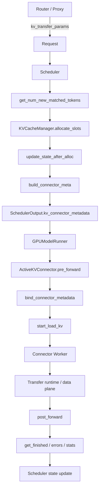

# vLLM v0.27.1 KV Transfer Runtime Path

이 문서는 Mooncake/NIXL 공통 상위 계층인 **vLLM V1 KV Connector lifecycle**을 source code 기준으로 추적한다.

기준: `vllm-project/vllm:v0.27.1`

---

## 1. 전체 call path



핵심은 **Scheduler connector와 Worker connector가 분리**되어 있다는 점이다.

- Scheduler side: 어떤 request가 remote KV를 필요로 하는지, 어떤 block ID가 대상인지 결정한다.
- Worker side: 실제 KV tensor memory registration, handshake, transfer submit/completion을 수행한다.

---

## 2. 설정 진입점: `KVTransferConfig`

Source:

- `vllm/config/kv_transfer.py`

주요 field:

```text
kv_connector
engine_id
kv_buffer_device
kv_role
kv_connector_extra_config
kv_connector_module_path
kv_load_failure_policy
```

### `kv_connector`

connector 구현 이름이다.

예:

```json
{"kv_connector":"MooncakeConnector","kv_role":"kv_producer"}
```

```json
{"kv_connector":"NixlConnector","kv_role":"kv_consumer"}
```

### `engine_id`

remote engine을 식별하는 논리 ID다. 지정하지 않으면 UUID를 만든다. P/D orchestration에서는 router가 `kv_transfer_params`를 통해 remote engine identity를 전달하므로 engine restart 시 stale identity가 운영 이슈가 된다.

### `kv_role`

- `kv_producer`: 보통 Prefill
- `kv_consumer`: 보통 Decode
- `kv_both`: 일부 connector/기능에서 양방향

NIXL v0.27.1은 `kv_both` 사용을 deprecated warning으로 다루고 producer/consumer 분리를 권장한다.

### `kv_buffer_device`

특히 NIXL에서 중요하다.

- `cuda`: VRAM을 직접 transfer registration 대상으로 사용
- `cpu`: host transfer buffer를 사용하고 D2H/H2D copy가 추가될 수 있음

### `kv_load_failure_policy`

- `fail`: remote KV load 실패를 request failure로 처리
- `recompute`: 실패한 block을 invalid 처리하고 local recompute 경로로 회복

P/D가 실제로 동작하는지 인증할 때 `recompute`는 문제를 숨길 수 있다. 초기 certification에서는 `fail`이 관측성이 더 좋다.

---

## 3. Factory 분기

Source:

- `vllm/distributed/kv_transfer/kv_connector/factory.py`

`KVConnectorFactory`는 connector 이름을 lazy import한다.

v0.27.1 주요 등록:

```text
NixlConnector
NixlPullConnector
NixlPushConnector
MooncakeConnector
MooncakeStoreConnector
LMCacheConnectorV1
MultiConnector
...
```

중요:

```text
NixlConnector == backward-compatible alias of NixlPullConnector
```

따라서 설정에서 `NixlConnector`라고 쓰면 현재 의미는 **pull/READ path**다.

Factory는 같은 class를 두 역할로 각각 생성한다.

```python
KVConnectorFactory.create_connector(
    config=...,
    role=KVConnectorRole.SCHEDULER,
    kv_cache_config=...
)
```

그리고 Worker에서도 `role=WORKER`로 별도 생성한다.

---

## 4. Scheduler 생성 시점

Source:

- `vllm/v1/core/sched/scheduler.py`

Scheduler 초기화 시 `kv_transfer_config`가 있으면 connector scheduler를 만든다.

```text
Scheduler.__init__
  -> KVConnectorFactory.create_connector(role=SCHEDULER)
```

여기서 얻는 것은 실제 GPU transfer engine이 아니라 **request/block orchestration object**다.

또한 v0.27.1 Scheduler는 async load와 overlapping batch 때문에 consumer block free를 지연해야 하는지 판단한다.

```text
multiple_inflight_batches && is_kv_consumer
  -> defer_block_free = True
```

이는 transfer 중인 destination block이 다른 request에 재할당되어 write race가 나는 것을 막기 위한 lifecycle fence다.

---

## 5. WAITING request가 remote KV를 요구하는 과정

Scheduler의 waiting loop에서 request가 아직 compute되지 않았으면 먼저 local prefix cache hit를 계산한다.

그 다음 connector가 있으면:

```python
ext_tokens, load_kv_async = connector.get_num_new_matched_tokens(
    request,
    block_aligned_local,
)
```

여기서 connector가 알려주는 것은:

1. local cache 외에 remote에서 가져올 수 있는 token 수
2. load가 async인지

P/D disaggregation connector에서는 router가 request에 넣은 `kv_transfer_params`를 보고 remote prefill 여부를 결정한다.

### local partial tail 처리

v0.27.1은 local prefix hit가 block boundary에 딱 맞지 않을 때 remote hit가 더 길면 partial tail을 버리고 remote load가 덮도록 한다.

이 부분은 block ID와 token 수가 미묘하게 어긋나는 버그를 막는 중요한 scheduler logic이다.

---

## 6. destination block allocation

remote KV를 받을 때도 Decode GPU에는 먼저 **destination KV blocks**가 필요하다.

Scheduler는:

```text
get_num_new_matched_tokens
  -> num_external_computed_tokens
  -> KVCacheManager.allocate_slots(...)
```

async KV load이면 실제 model forward는 아직 수행하지 않는다.

```text
load_kv_async = True
  -> num_new_tokens = 0
  -> destination blocks allocation
  -> WAITING_FOR_REMOTE_KVS
```

즉 순서는 다음이다.

```text
remote KV가 올 예정임을 확인
  -> D 쪽 KV block address를 먼저 확보
  -> connector에게 local block IDs 전달
  -> 실제 data transfer 시작
```

Mooncake/NIXL 모두 결국 이 destination block ID를 실제 pointer/descriptor로 변환한다.

---

## 7. `update_state_after_alloc()`의 의미

block allocation이 끝난 직후:

```python
connector.update_state_after_alloc(
    request,
    kv_cache_manager.get_blocks(request_id),
    num_external_computed_tokens,
)
```

이 호출이 **request metadata와 실제 local KV block IDs를 연결하는 지점**이다.

### Mooncake

Decode remote prefill이면:

- remote_engine_id
- remote_bootstrap_addr
- transfer_id
- local block IDs

를 `PullReqMeta` 형태로 예약한다.

Prefill은 router가 준 `do_remote_decode` / `transfer_id`를 바탕으로 나중에 보낼 request를 추적한다.

### NIXL

remote request metadata와 local/remote block IDs를 scheduler metadata에 저장하고 lease/heartbeat 상태를 갱신한다.

---

## 8. `build_connector_meta()`

Scheduler step 마지막에:

```text
connector.build_connector_meta(scheduler_output)
  -> SchedulerOutput.kv_connector_metadata
```

이 object가 scheduler process에서 worker process로 넘어가는 **control-plane payload**다.

중요한 점:

- 여기에는 KV bytes 자체가 없다.
- request ID, transfer ID, local/remote block IDs, engine 정보 등 **transfer plan**만 있다.

실제 KV tensor는 이미 Worker process의 GPU memory에 존재한다.

---

## 9. Worker 진입점: `ActiveKVConnector`

Source:

- `vllm/v1/worker/gpu/kv_connector.py`

GPUModelRunner가 실제 KV cache tensor를 만든 후 Worker connector를 얻는다.

초기화 시:

```python
self.kv_connector.register_kv_caches(kv_caches_dict)
self.kv_connector.set_host_xfer_buffer_ops(copy_kv_blocks)
```

이 `register_kv_caches()`가 두 backend에서 매우 중요한 분기점이다.

### Mooncake

- tensor `data_ptr()` / storage pointer 수집
- layer/group별 block length 계산
- `TransferEngine.batch_register_memory()`

### NIXL

- local NIXL descriptors 생성
- memory type VRAM/DRAM 결정
- `nixl_wrapper.register_memory()`
- prepared descriptor list/handle 생성
- handshake metadata 생성

---

## 10. `pre_forward()`

실행 직전:

```python
ActiveKVConnector.pre_forward(scheduler_output)
```

내부:

```text
handle_preemptions()
bind_connector_metadata()
start_load_kv()
```

async load-only scheduler step에서는 model forward가 없어도 `no_forward()`가 동일 connector path를 실행한다.

따라서 remote KV load는 반드시 attention forward에 종속된 layer callback 방식일 필요가 없다. Mooncake/NIXL은 현재 bulk/block transfer를 background path로 수행한다.

---

## 11. Connector Worker가 실제 transfer runtime으로 내려가는 지점

### Mooncake

```text
start_load_kv()
  -> decoder receiver loop
  -> bootstrap query
  -> ZMQ request to P worker
  -> P builds src/dst pointers
  -> TransferEngine.batch_transfer_sync_write()
```

실제 bytes를 움직이는 마지막 vLLM-visible 함수는 P worker의 `_send_blocks()`다.

### NIXL Pull

```text
start_load_kv()
  -> handshake if needed
  -> _read_blocks_for_req()
  -> make_prepped_xfer("READ", ...)
  -> nixl_wrapper.transfer(handle)
```

### NIXL Push

```text
D sends PUSH_REG notification
P matches finished blocks + D registration
  -> _xfer_blocks_for_req()
  -> make_prepped_xfer("WRITE", ...)
  -> nixl_wrapper.transfer(handle)
```

---

## 12. `post_forward()`와 completion

Worker step 이후:

```python
kv_connector.get_finished(finished_req_ids)
kv_connector.get_block_ids_with_load_errors()
kv_connector.get_kv_connector_stats()
```

결과는 `KVConnectorOutput`으로 Scheduler에 돌아간다.

여기서 Scheduler는:

- remote KV receive가 끝난 request를 `WAITING_FOR_REMOTE_KVS`에서 진행 가능 상태로 이동
- 실패 block을 invalid 처리
- `recompute` 정책이면 local compute로 복구
- send completion이면 producer block release 가능 여부 갱신

한다.

---

## 13. block lifetime이 중요한 이유

P/D transfer에서 흔한 장애는 "전송 API 실패"만이 아니다.

더 위험한 것은:

```text
P가 prefill 완료
 -> scheduler가 block을 free
 -> allocator가 다른 request에 재사용
 -> D가 늦게 old pointer/descriptor를 읽음
```

그래서 connector는 completion protocol과 block retention을 구현한다.

### Mooncake

Prefill `request_finished()`가 `delay_free_blocks=True`를 반환할 수 있다. P worker가 실제 send completion을 확인할 때까지 block을 유지한다. timeout으로 stranded block을 회수하는 로직도 있다.

### NIXL

Prefill block은 lease를 가진다. Decode가 waiting queue에 오래 있으면 heartbeat로 lease를 연장하며, successful read notification을 받아야 P가 안전하게 free한다.

heterogeneous TP에서는 한 P rank의 data를 여러 D rank가 읽을 수 있으므로 **expected notification count**까지 계산한다.

---

## 14. TP/block layout이 data path에 미치는 영향

KV transfer는 단순 `[block_id] -> memcpy`가 아니다.

다음 요소가 pointer 계산에 직접 영향을 준다.

- TP size/rank
- producer/consumer TP ratio
- KV head replication 여부
- MLA 여부
- Mamba/GDN hybrid state
- sliding window
- logical block size vs attention kernel physical block size
- HND/NHD layout
- pipeline parallel layer ownership

v0.27.1 Mooncake와 NIXL 모두 이 문제를 적극적으로 처리한다.

특히 두 connector 모두 non-MLA에서 transfer-friendly layout으로 HND를 요구/선호한다.

---

## 15. Router가 빠지면 안 되는 이유

Connector는 remote peer를 스스로 "서비스 디스커버리"하지 않는다. request가 어느 P에서 prefill되었고 어느 D로 handoff되는지는 상위 orchestrator가 알아야 한다.

Router/Proxy가 만드는 `kv_transfer_params`는 connector별 contract가 다르다.

### Mooncake 예

핵심:

```text
transfer_id
remote_engine_id
remote_bootstrap_addr
do_remote_prefill
do_remote_decode
```

### NIXL 예

핵심:

```text
remote_engine_id
remote_request_id
remote_host
remote_port
remote_block_ids
tp_size / pp_size
```

따라서 Router가 NIXL용 contract를 Mooncake에 넘기거나 반대로 넘기면 connector import는 성공해도 data plane은 시작되지 않는다.

---

## 16. 운영 debugging 시 source를 따라가는 순서

### Gate 1 — config

```text
KVTransferConfig
 -> connector name / role / extra config
```

### Gate 2 — router params

request log에서 `kv_transfer_params`가 connector가 요구하는 필드를 포함하는지 확인한다.

### Gate 3 — scheduler

```text
get_num_new_matched_tokens
update_state_after_alloc
build_connector_meta
```

remote tokens가 0으로 떨어지는지 확인한다.

### Gate 4 — worker memory registration

Mooncake:

```text
batch_register_memory
```

NIXL:

```text
get_reg_descs
register_memory
prepared xfer descriptor
```

### Gate 5 — handshake

Mooncake:

- bootstrap HTTP `/register`, `/query`
- worker ZMQ side channel

NIXL:

- vLLM ZMQ `GET_META`
- compatibility hash
- `add_remote_agent`

### Gate 6 — transfer submit

Mooncake:

```text
batch_transfer_sync_write
```

NIXL:

```text
make_prepped_xfer(READ/WRITE)
transfer(handle)
```

### Gate 7 — completion

P block이 실제 completion 후에만 free되는지 확인한다.

### Gate 8 — semantic proof

Decode가 받은 KV를 사용했는지 확인한다. 가장 강한 검증은 **local prompt recompute가 없다는 것**이다.

---

## 17. Source references

- https://github.com/vllm-project/vllm/blob/v0.27.1/vllm/config/kv_transfer.py
- https://github.com/vllm-project/vllm/blob/v0.27.1/vllm/distributed/kv_transfer/kv_connector/factory.py
- https://github.com/vllm-project/vllm/blob/v0.27.1/vllm/v1/core/sched/scheduler.py
- https://github.com/vllm-project/vllm/blob/v0.27.1/vllm/v1/worker/gpu/kv_connector.py
- https://github.com/vllm-project/vllm/tree/v0.27.1/vllm/distributed/kv_transfer/kv_connector/v1

다음 문서부터 이 공통 lifecycle 아래에서 Mooncake와 NIXL이 각각 어떻게 구현되는지 분리한다.
